# 信息架构与菜单

## 1. 文档信息

| 项目 | 内容 |
| --- | --- |
| 当前阶段 | 第一阶段：需求与架构（步骤 3） |
| 文档版本 | V0.1（待第一阶段评审） |
| 导航形态 | 顶部栏 + 左侧分组菜单 + 内容区 + 面包屑 |
| 应用形态 | 前后端分离的单页后台管理系统（SPA） |

## 2. 信息架构原则

1. 按用户任务组织导航，不按数据库表名组织导航。
2. 员工侧突出“找课程—申请—报名—参训—获得证书”。
3. 主管侧突出待审批任务，HR 侧突出备案和培训运营，管理员侧突出基础数据维护。
4. 相同业务对象尽量复用详情信息结构，但按角色控制可见操作。
5. 菜单是否显示、页面是否可访问、按钮是否可执行分别校验。
6. 当前仅规划页面和路径，不编写 Vue Router 配置代码。

## 3. 系统信息架构图

```mermaid
flowchart TB
    App["企业内部培训管理系统"] --> Public["公共区域"]
    App --> Main["登录后主布局"]

    Public --> Login["登录"]
    Public --> Forbidden["403 无权限"]
    Public --> NotFound["404 未找到"]

    Main --> Dashboard["首页 / 控制台"]
    Main --> Center["培训中心"]
    Main --> My["我的培训"]
    Main --> Approval["审批管理"]
    Main --> Operation["培训运营"]
    Main --> System["系统管理"]
    Main --> Account["个人菜单"]

    Center --> CourseList["课程列表"]
    CourseList --> CourseDetail["课程详情"]

    My --> MyRequests["我的申请"]
    MyRequests --> RequestCreate["提交申请"]
    MyRequests --> RequestDetail["申请详情"]
    My --> MyRegistrations["我的报名"]
    MyRegistrations --> RegistrationDetail["报名详情"]
    My --> MyTests["我的测试"]
    My --> MyCertificates["我的证书"]
    MyCertificates --> CertificateDetail["证书详情"]

    Approval --> DeptApproval["主管审批"]
    Approval --> HrFiling["HR 备案"]
    DeptApproval --> RequestDetail
    HrFiling --> RequestDetail

    Operation --> Attendance["报名与签到"]
    Operation --> RatingReview["评分管理"]
    Operation --> TestManagement["测试成绩"]
    Operation --> CertificateManagement["证书管理"]
    CertificateManagement --> CertificateDetail

    System --> Employees["员工管理"]
    System --> Departments["部门预算"]
    System --> Trainers["讲师管理"]
    System --> CourseManagement["课程管理"]
    System --> Blacklist["黑名单管理"]
    System --> Roles["角色权限（待确认）"]

    Account --> Profile["个人信息"]
    Account --> Logout["退出登录"]
```



## 4. 菜单结构表

| 一级分组 | 二级菜单 | 建议路径 | 优先级 | 允许角色 | 状态/说明 |
| --- | --- | --- | --- | --- | --- |
| 首页 | 控制台 | `/dashboard` | P0 | 全部已登录角色 | 已确认；卡片和待办按角色变化 |
| 培训中心 | 课程中心 | `/courses` | P0 | 全部已登录角色 | 已确认；详情使用动态路径 |
| 我的培训 | 我的申请 | `/my/requests` | P0 | 员工 | 已确认 |
| 我的培训 | 我的报名 | `/my/registrations` | P0 | 员工 | 已确认 |
| 我的培训 | 我的测试 | `/my/tests` | P2 | 员工（待确认） | 员工查询个人成绩权限待确认 |
| 我的培训 | 我的证书 | `/my/certificates` | P0 | 员工 | 已确认 |
| 审批管理 | 主管审批 | `/approvals/department` | P0 | 部门主管 | 已确认；暂定本部门数据 |
| 审批管理 | HR 备案 | `/filings/hr` | P0 | HR | 已确认 |
| 培训运营 | 报名与签到 | `/operations/attendance` | P0 | HR、管理员 | 暂定用页签合并报名列表和签到操作 |
| 培训运营 | 评分管理 | `/operations/ratings` | P2 | HR | 已确认；管理员权限待确认 |
| 培训运营 | 测试成绩 | `/operations/tests` | P2 | HR | 已确认；包含录入和查询 |
| 培训运营 | 证书管理 | `/operations/certificates` | P0 | HR | 已确认；管理员权限待确认 |
| 系统管理 | 员工管理 | `/system/employees` | P1 | 管理员 | 已确认 |
| 系统管理 | 部门预算 | `/system/departments` | P1 | 管理员 | 已确认 |
| 系统管理 | 讲师管理 | `/system/trainers` | P1 | 管理员 | 已确认 |
| 系统管理 | 课程管理 | `/system/courses` | P1 | 管理员 | 已确认 |
| 系统管理 | 黑名单管理 | `/system/blacklist` | P2 | 管理员；HR 待确认 | 已确认业务，HR 权限待确认 |
| 系统管理 | 角色权限 | `/system/roles` | P2 | 管理员（待确认） | 未进入冻结范围前不制作 |
| 个人菜单 | 个人信息 | `/profile` | P1 | 全部已登录角色 | 已确认 |
| 个人菜单 | 退出登录 | 非页面操作 | P0 | 全部已登录角色 | 已确认 |

## 5. 各角色菜单示意

以下菜单只表示角色直接权限；多角色账号暂定合并各角色菜单。

### 5.1 员工

```text
首页
└── 控制台
培训中心
└── 课程中心
我的培训
├── 我的申请
├── 我的报名
├── 我的测试（待确认）
└── 我的证书
个人菜单
├── 个人信息
└── 退出登录
```

### 5.2 部门主管

```text
首页
└── 控制台
培训中心
└── 课程中心
审批管理
└── 主管审批
个人菜单
├── 个人信息
└── 退出登录
```

如果主管账号同时拥有员工角色，则额外显示“我的培训”。

### 5.3 HR

```text
首页
└── 控制台
培训中心
└── 课程中心
审批管理
└── HR 备案
培训运营
├── 报名与签到
├── 评分管理
├── 测试成绩
└── 证书管理
个人菜单
├── 个人信息
└── 退出登录
```

### 5.4 管理员

```text
首页
└── 控制台
培训中心
└── 课程中心
培训运营
└── 报名与签到
系统管理
├── 员工管理
├── 部门预算
├── 讲师管理
├── 课程管理
├── 黑名单管理
└── 角色权限（待确认）
个人菜单
├── 个人信息
└── 退出登录
```

管理员是否显示 HR 备案、评分、测试和证书管理菜单，等待权限评审，不在本版默认开放。

## 6. 页面标题、面包屑和返回规则

| 页面类型 | 标题示例 | 面包屑示例 | 默认返回目标 |
| --- | --- | --- | --- |
| 一级列表 | 课程中心 | 培训中心 / 课程中心 | 不显示返回按钮 |
| 我的业务列表 | 我的申请 | 我的培训 / 我的申请 | 不显示返回按钮 |
| 运营列表 | 报名与签到 | 培训运营 / 报名与签到 | 不显示返回按钮 |
| 系统管理列表 | 员工管理 | 系统管理 / 员工管理 | 不显示返回按钮 |
| 详情 | 课程详情 | 培训中心 / 课程中心 / 课程详情 | 返回来源列表；无来源时返回课程中心 |
| 新增表单 | 新增课程 | 系统管理 / 课程管理 / 新增课程 | 返回课程管理列表；未保存时二次确认 |
| 编辑表单 | 编辑课程 | 系统管理 / 课程管理 / 编辑课程 | 返回课程管理列表；未保存时二次确认 |
| 申请详情 | 申请详情 | 根据入口显示“我的申请/主管审批/HR 备案 / 申请详情” | 返回实际来源页 |
| 证书详情 | 证书详情 | 根据入口显示“我的证书/证书管理 / 证书详情” | 返回实际来源页 |

### 6.1 返回与刷新规则

- 列表进入详情时保留搜索条件、分页和滚动位置；返回列表后恢复。
- 直接打开详情链接时，返回按钮使用该角色可访问的默认列表页。
- 表单存在未保存修改时，离开页面需要二次确认。
- 操作成功后优先留在当前上下文并刷新数据；新增成功可进入详情或返回列表，最终在交互阶段确认。
- 登录失效时记录当前地址；重新登录后是否回到原地址待确认。

## 7. 角色化控制台信息架构（暂定）

| 角色 | 首要内容 | 快捷入口 | 待确认数据 |
| --- | --- | --- | --- |
| 员工 | 待开始课程、最近申请、证书提醒 | 浏览课程、我的申请、我的报名 | 培训学时、申请状态统计口径 |
| 部门主管 | 待审批数量和最近申请 | 进入主管审批 | 部门范围和逾期定义 |
| HR | 待备案、待签到、待生成证书 | HR 备案、报名与签到、证书管理 | 各待办接口及统计周期 |
| 管理员 | 员工、讲师、课程和异常数据概览 | 新增员工、新增课程、发布课程 | 统计接口、系统健康信息是否展示 |

## 8. 待确认事项

1. 多角色账号是合并菜单还是允许切换身份。
2. 首页是否需要真实统计接口，第一版是否只显示快捷入口。
3. 报名管理与签到管理采用一个页面的页签，还是拆成两个菜单。
4. 管理员是否显示全部培训运营菜单。
5. HR 是否显示黑名单管理菜单。
6. 是否需要角色权限管理菜单和页面。
7. 个人信息是否允许编辑联系方式或修改密码。
8. 侧边栏菜单顺序需由项目负责人最终确认。
