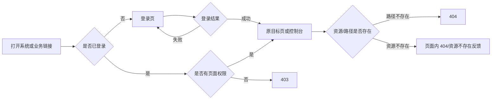
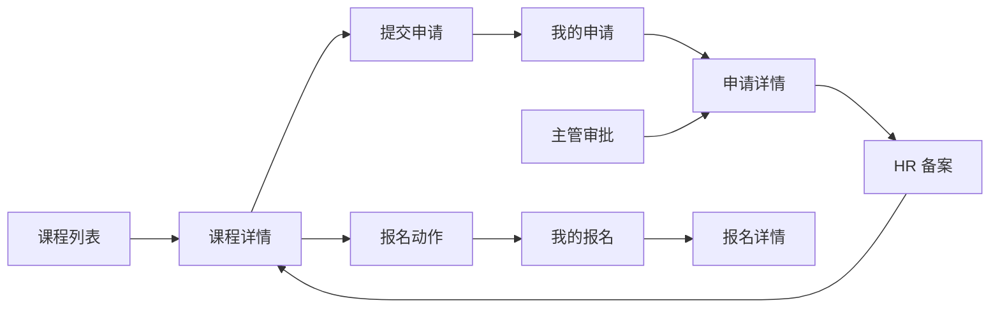
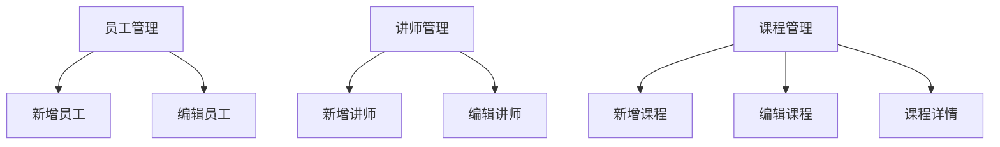

# 页面与路由规划

## 1. 文档信息

| 项目 | 内容 |
| --- | --- |
| 当前阶段 | 第一阶段：需求与架构（步骤 4） |
| 文档版本 | V0.1（待第一阶段评审） |
| 当前性质 | 页面和路径设计，不是 Vue Router 配置代码 |
| 路径原则 | 小写英文、复数资源、业务分组清晰、动态参数使用 `:id` |

## 2. 页面优先级说明

| 优先级 | 定义 | 当前处理 |
| --- | --- | --- |
| P0 | 支撑登录、申请、审批、备案、报名、签到、证书主流程 | 第一批完成流程、线框和高保真设计 |
| P1 | 支撑员工、部门、讲师、课程等基础数据维护 | P0 设计评审后推进 |
| P2 | 黑名单、评分、测试、统计、权限维护等增强功能 | P1 后推进，未确认页面先保留规划 |

“申请详情、报名详情”等标为 P0 辅助页面，是根据项目分工计划和核心流程补充的必要上下文；第二阶段可评审决定使用独立页面、抽屉或弹窗。

## 3. 页面清单汇总

| 页面分组 | P0 | P1 | P2/待确认 |
| --- | --- | --- | --- |
| 公共与框架 | 登录、控制台、403、404 | 个人信息 | — |
| 培训中心 | 课程列表、课程详情 | — | — |
| 我的培训 | 提交申请、我的申请、申请详情、我的报名、报名详情、我的证书、证书详情 | — | 讲师评分、我的测试 |
| 审批管理 | 主管审批、HR 备案 | — | — |
| 培训运营 | 报名与签到、证书管理、证书详情 | — | 评分管理、测试成绩录入与查询 |
| 系统管理 | — | 员工管理、部门预算、讲师管理、课程管理及新增编辑 | 黑名单、角色权限 |
| 统计 | — | — | 统计展示 |

## 4. 路由规划表

### 4.1 公共页面与主框架

| 页面编号 | 页面名称 | 建议路径 | 路由名称 | 页面类型 | 所属布局 | 登录要求 | 允许角色 | 上级页面 | 状态 |
| --- | --- | --- | --- | --- | --- | --- | --- | --- | --- |
| PUB-01 | 登录 | `/login` | `Login` | 公共表单 | 登录布局 | 否 | 全部 | 无 | 已确认 |
| COM-01 | 控制台 | `/dashboard` | `Dashboard` | 首页 | 主布局 | 是 | 全部角色 | 无 | 已确认，内容暂定 |
| COM-02 | 个人信息 | `/profile` | `Profile` | 详情 | 主布局 | 是 | 全部角色 | 控制台 | 已确认，编辑能力待确认 |
| PUB-02 | 403 无权限 | `/403` | `Forbidden` | 异常页 | 简洁公共布局 | 是 | 全部角色 | 原访问页 | 已确认 |
| PUB-03 | 404 未找到 | `/:pathMatch(.*)*` | `NotFound` | 异常页 | 简洁公共布局 | 否 | 全部 | 原访问页 | 已确认 |

### 4.2 培训中心与我的培训

| 页面编号 | 页面名称 | 建议路径 | 路由名称 | 页面类型 | 所属布局 | 登录要求 | 允许角色 | 上级页面 | 优先级/状态 |
| --- | --- | --- | --- | --- | --- | --- | --- | --- | --- |
| CRS-01 | 课程列表 | `/courses` | `CourseList` | 列表 | 主布局 | 是 | 全部角色 | 控制台 | P0，已确认 |
| CRS-02 | 课程详情 | `/courses/:id` | `CourseDetail` | 详情 | 主布局 | 是 | 全部角色 | 课程列表 | P0，已确认 |
| MY-REQ-01 | 我的申请 | `/my/requests` | `MyRequestList` | 列表 | 主布局 | 是 | 员工 | 控制台 | P0，已确认 |
| MY-REQ-02 | 提交培训申请 | `/my/requests/new` | `RequestCreate` | 表单 | 主布局 | 是 | 员工 | 课程详情/我的申请 | P0，已确认 |
| REQ-01 | 申请详情 | `/requests/:id` | `RequestDetail` | 详情 | 主布局 | 是 | 员工本人、部门主管、HR | 实际来源页 | P0 辅助，暂定独立页面 |
| MY-REG-01 | 我的报名 | `/my/registrations` | `MyRegistrationList` | 列表 | 主布局 | 是 | 员工 | 控制台 | P0，已确认 |
| REG-01 | 报名详情 | `/registrations/:id` | `RegistrationDetail` | 详情 | 主布局 | 是 | 员工本人、HR、管理员 | 实际来源页 | P0 辅助，暂定独立页面 |
| MY-RAT-01 | 提交讲师评分 | `/my/ratings/:registrationId/new` | `RatingCreate` | 表单 | 主布局 | 是 | 员工 | 我的报名 | P2，已确认业务 |
| MY-TEST-01 | 我的测试 | `/my/tests` | `MyTestList` | 列表 | 主布局 | 是 | 员工（待确认） | 控制台 | P2，页面权限待确认 |
| MY-CERT-01 | 我的证书 | `/my/certificates` | `MyCertificateList` | 列表 | 主布局 | 是 | 员工 | 控制台 | P0，已确认 |
| CERT-01 | 证书详情 | `/certificates/:id` | `CertificateDetail` | 详情 | 主布局 | 是 | 员工本人、HR；管理员待确认 | 实际来源页 | P0，已确认 |

### 4.3 审批管理与培训运营

| 页面编号 | 页面名称 | 建议路径 | 路由名称 | 页面类型 | 所属布局 | 登录要求 | 允许角色 | 上级页面 | 优先级/状态 |
| --- | --- | --- | --- | --- | --- | --- | --- | --- | --- |
| APR-01 | 主管审批 | `/approvals/department` | `DepartmentApproval` | 列表/操作 | 主布局 | 是 | 部门主管 | 控制台 | P0，已确认 |
| FIL-01 | HR 备案 | `/filings/hr` | `HrFiling` | 列表/操作 | 主布局 | 是 | HR；管理员待确认 | 控制台 | P0，已确认 |
| OPS-ATT-01 | 报名与签到 | `/operations/attendance` | `AttendanceManagement` | 列表/操作 | 主布局 | 是 | HR、管理员 | 控制台 | P0，已确认；暂定页签合并 |
| OPS-RAT-01 | 评分管理 | `/operations/ratings` | `RatingManagement` | 列表/操作 | 主布局 | 是 | HR；管理员待确认 | 控制台 | P2，已确认业务 |
| OPS-TEST-01 | 测试成绩 | `/operations/tests` | `TestManagement` | 列表/操作 | 主布局 | 是 | HR；管理员待确认 | 控制台 | P2，已确认业务 |
| OPS-TEST-02 | 录入测试成绩 | `/operations/tests/new` | `TestCreate` | 表单 | 主布局 | 是 | HR；管理员待确认 | 测试成绩 | P2，暂定独立页面 |
| OPS-CERT-01 | 证书管理 | `/operations/certificates` | `CertificateManagement` | 列表/操作 | 主布局 | 是 | HR；管理员待确认 | 控制台 | P0，已确认 |

### 4.4 系统管理与统计

| 页面编号 | 页面名称 | 建议路径 | 路由名称 | 页面类型 | 所属布局 | 登录要求 | 允许角色 | 上级页面 | 优先级/状态 |
| --- | --- | --- | --- | --- | --- | --- | --- | --- | --- |
| SYS-EMP-01 | 员工管理 | `/system/employees` | `EmployeeManagement` | 列表 | 主布局 | 是 | 管理员 | 控制台 | P1，已确认 |
| SYS-EMP-02 | 新增员工 | `/system/employees/new` | `EmployeeCreate` | 表单 | 主布局 | 是 | 管理员 | 员工管理 | P1，已确认 |
| SYS-EMP-03 | 编辑员工 | `/system/employees/:id/edit` | `EmployeeEdit` | 表单 | 主布局 | 是 | 管理员 | 员工管理 | P1，已确认 |
| SYS-DEPT-01 | 部门预算管理 | `/system/departments` | `DepartmentManagement` | 列表/表单 | 主布局 | 是 | 管理员 | 控制台 | P1，已确认 |
| SYS-TRN-01 | 讲师管理 | `/system/trainers` | `TrainerManagement` | 列表 | 主布局 | 是 | 管理员 | 控制台 | P1，已确认 |
| SYS-TRN-02 | 新增讲师 | `/system/trainers/new` | `TrainerCreate` | 表单 | 主布局 | 是 | 管理员 | 讲师管理 | P1，已确认 |
| SYS-TRN-03 | 编辑讲师 | `/system/trainers/:id/edit` | `TrainerEdit` | 表单 | 主布局 | 是 | 管理员 | 讲师管理 | P1，已确认 |
| SYS-CRS-01 | 课程管理 | `/system/courses` | `CourseManagement` | 列表 | 主布局 | 是 | 管理员 | 控制台 | P1，已确认 |
| SYS-CRS-02 | 新增课程 | `/system/courses/new` | `CourseCreate` | 表单 | 主布局 | 是 | 管理员 | 课程管理 | P1，已确认 |
| SYS-CRS-03 | 编辑课程 | `/system/courses/:id/edit` | `CourseEdit` | 表单 | 主布局 | 是 | 管理员 | 课程管理 | P1，已确认 |
| SYS-BLK-01 | 黑名单管理 | `/system/blacklist` | `BlacklistManagement` | 列表/操作 | 主布局 | 是 | 管理员；HR 待确认 | 控制台 | P2，已确认业务 |
| SYS-ROLE-01 | 角色权限管理 | `/system/roles` | `RoleManagement` | 列表/配置 | 主布局 | 是 | 管理员（待确认） | 控制台 | P2，是否纳入待确认 |
| STAT-01 | 统计展示 | `/statistics` | `Statistics` | 统计 | 主布局 | 是 | 按角色授权 | 控制台 | P2，指标待确认 |

## 5. 路由元信息规划

正式创建工程时，每个受保护路由建议具有以下元信息；当前只定义含义，不编写代码。

| 元信息 | 用途 | 示例 |
| --- | --- | --- |
| `title` | 页面标题、浏览器标题 | `课程详情` |
| `requiresAuth` | 是否要求登录 | `true` |
| `roles` | 允许访问的角色集合 | `['HR', 'ADMIN']` |
| `permissions` | 精细到操作或页面的权限码 | 暂待后端确认 |
| `menuKey` | 用于侧边菜单选中状态 | `operations-certificates` |
| `breadcrumb` | 面包屑配置 | `培训运营 / 证书管理` |
| `keepAlive` | 列表返回时是否保留状态 | 列表页暂定 `true` |
| `priority` | 页面设计优先级 | `P0` |

## 6. 页面跳转关系

### 6.1 登录和权限跳转

### 6.2 申请、审批、备案与报名

说明：`HR 备案 → 报名` 是否为强制前置关系待业务确认；本阶段主流程暂按强制前置设计。

### 6.3 签到、完成与证书

### 6.4 系统管理跳转

## 7. 路由守卫与异常规则（设计要求）

1. 未登录访问受保护路由：进入 `/login`，附带原目标地址。
2. 已登录访问 `/login`：暂定进入 `/dashboard`。
3. 已登录但角色不匹配：进入 `/403`，不得只依赖菜单隐藏。
4. 动态路由参数格式错误或资源不存在：页面展示资源不存在，并提供返回有权限列表页的入口。
5. 登录过期：清理本地登录态，进入登录页；是否保留未提交表单待交互阶段确认。
6. 多角色用户：暂按角色并集判断；若后续采用身份切换，需要重新评审菜单和路由规则。
7. 浏览器刷新详情页：必须能够根据 URL 恢复页面，不依赖从列表页传递完整对象。
8. 路由只控制前端体验，接口仍由后端校验角色、数据范围和业务状态。

## 8. 第一阶段待确认的页面与路由问题

| 编号 | 问题 | 当前方案 |
| --- | --- | --- |
| ROUTE-Q-001 | 申请详情、报名详情采用独立页面还是抽屉 | 先保留独立可访问路由，线框阶段评审 |
| ROUTE-Q-002 | 报名管理与签到管理是否拆分 | 暂合并为 `/operations/attendance` 的页签 |
| ROUTE-Q-003 | 测试录入采用独立页还是弹窗 | 先保留 `/operations/tests/new`，线框阶段评审 |
| ROUTE-Q-004 | 员工个人测试页是否保留 | 等待权限和产品范围确认 |
| ROUTE-Q-005 | 角色权限管理页面是否纳入 P2 | 等待后端角色维护接口确认 |
| ROUTE-Q-006 | 管理员是否能进入 HR 备案、评分、测试、证书页面 | 等待权限评审 |
| ROUTE-Q-007 | 多角色用户使用权限并集还是身份切换 | 暂按权限并集 |
| ROUTE-Q-008 | 登录后是否回到原目标页 | 暂定回跳，等待认证方案确认 |

## 9. 第一阶段结论

- 所有已规划页面均有唯一建议路径，并标记布局、登录要求、允许角色和上级页面。
- P0 主流程的入口与跳转关系已经连续，不依赖手动修改数据库的概念步骤。
- 待确认页面和权限不会在评审前被当作最终范围。
- 第一阶段评审通过后，进入步骤 5～6：核心业务流程细化与 P0 低保真线框设计。
