# 核心业务流程

## 1. 文档信息

| 项目 | 内容 |
| --- | --- |
| 项目名称 | 企业内部培训管理系统 |
| 当前阶段 | 第二阶段：流程与线框（步骤 5） |
| 文档版本 | V1.0（业务流程评审通过） |
| 评审状态 | 已通过；依据 2026-08-01 用户确认进入步骤 6 |
| 本文范围 | 登录、基础数据、课程发布、申请、主管审批、HR 备案、报名、签到、评分、测试、证书 |
| 本轮不包含 | P0 低保真线框、高保真视觉、HTML 原型、Vue 工程、真实接口联调 |

## 2. 流程设计依据与标记

### 2.1 主要依据

- `前端工作的执行步骤与输出成果.md`
- `项目分工计划.md`
- `项目开发规范.md`
- `数据库设计文档.doc`
- `frontend-design/01-前端需求清单.md`
- `frontend-design/02-角色权限矩阵.md`
- `frontend-design/03-信息架构与菜单.md`
- `frontend-design/04-页面与路由规划.md`

### 2.2 确认状态

| 标记 | 含义 |
| --- | --- |
| 已确认 | 多份项目文档口径一致，可以作为当前流程依据 |
| 暂定 | 为形成连续演示链路采用的方案，需要评审确认 |
| 待确认 | 文档存在冲突或规则缺失，流程中保留分支，不作为最终业务约定 |

### 2.3 流程边界原则

1. 前端负责入口、信息展示、交互反馈和页面跳转，不自行决定业务状态。
2. 状态流转、数据范围、容量、重复、黑名单、预算、学时和证书资格必须由后端最终校验。
3. 本文使用英文枚举描述接口状态，页面展示中文。
4. 当前完整主流程暂按“HR 备案后员工手动报名”串联；这是演示基线，不代表该规则已经冻结。
5. 任何失败不得要求演示人员手动修改数据库才能继续；应通过页面重新操作、修正数据或选择另一条合法记录。

## 3. 完整业务主流程

### 3.1 端到端流程总览

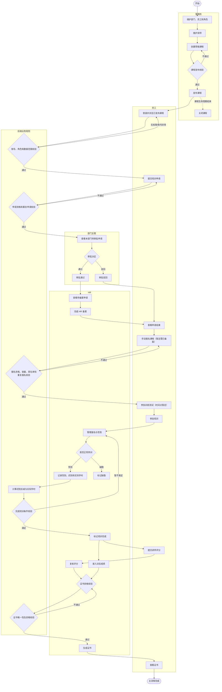

### 3.2 跨角色主流程时序

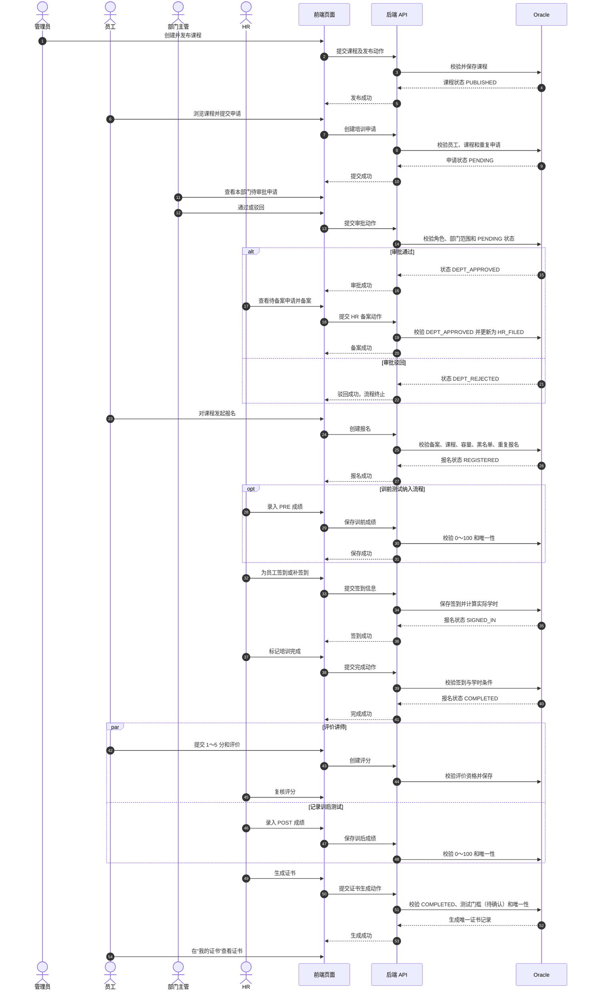

### 3.3 主流程阶段与交接物

| 阶段 | 主要角色 | 输入 | 核心动作 | 业务输出 | 下一责任角色 | 状态 |
| --- | --- | --- | --- | --- | --- | --- |
| 基础准备 | 管理员 | 部门、员工、讲师资料 | 维护基础数据 | 可用员工、部门、讲师 | 管理员 | 已确认 |
| 课程发布 | 管理员 | 完整课程草稿 | 校验并发布 | `PUBLISHED` 课程 | 员工 | 已确认 |
| 申请提交 | 员工 | 已发布课程、申请理由 | 提交培训申请 | `PENDING` 申请 | 部门主管 | 已确认 |
| 部门审批 | 部门主管 | 本部门待审批申请 | 通过或驳回 | `DEPT_APPROVED` 或 `DEPT_REJECTED` | HR 或流程结束 | 已确认 |
| HR 备案 | HR | 主管已通过申请 | 完成备案 | `HR_FILED` 申请 | 员工 | 已确认 |
| 课程报名 | 员工 | 可报名课程及资格 | 手动报名 | `REGISTERED` 报名 | HR/管理员 | 暂定备案是前置条件 |
| 训前测试 | HR、员工 | 已报名员工、测试链接/成绩 | 参加并录入 PRE 成绩 | PRE 测试记录 | 员工、HR | 测试执行方式待确认 |
| 签到执行 | HR/管理员 | 有效报名 | 扫码或手动签到 | `SIGNED_IN`、签到记录、实际学时 | HR/管理员 | 已确认 |
| 缺勤处理 | HR/管理员 | 课程结束仍未签到 | 标记缺勤 | `ABSENT` | 管理员/HR | 是否联动黑名单待确认 |
| 培训完成 | HR/管理员 | 已签到且满足学时条件 | 标记完成 | `COMPLETED` | 员工、HR | 已确认，学时门槛待确认 |
| 评分与测试 | 员工、HR | 已完成培训 | 评分、复核、录入 POST | 评分和 POST 测试记录 | HR | 已确认业务，资格细则待确认 |
| 证书生成 | HR | 完成培训且满足证书条件 | 生成证书 | 唯一证书记录 | 员工 | 测试及格门槛待确认 |
| 证书查看 | 员工 | 本人证书 | 查询详情 | 培训成果可见 | 流程结束 | 已确认 |

## 4. 登录与角色入口流程

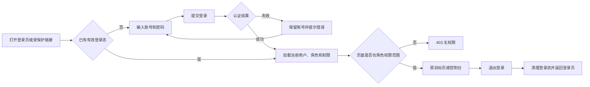

| 节点 | 当前角色 | 入口页面 | 用户动作 | 前置状态 | 成功结果 | 失败/禁止反馈 | 下一步 |
| --- | --- | --- | --- | --- | --- | --- | --- |
| AUTH-01 | 全部 | `/login` | 提交账号和密码 | 未登录 | 获得有效登录态 | 账号或密码错误、账号不可用、网络失败 | AUTH-02 |
| AUTH-02 | 已登录用户 | 登录完成回跳 | 加载当前用户 | 登录成功 | 获得用户、角色、权限 | 获取用户失败则清理登录态并重新登录 | AUTH-03 |
| AUTH-03 | 已登录用户 | 目标页面 | 进入页面 | 已加载权限 | 进入授权页面 | 无权限进入 `/403` | 对应业务流程 |
| AUTH-04 | 已登录用户 | 顶部个人菜单 | 退出登录 | 已登录 | 清理登录态并回登录页 | 后端退出失败时仍需明确本地处理策略 | 流程结束 |

说明：Token 或 Session、过期刷新、登录后回跳规则尚未冻结，本文不锁定实现。

## 5. 基础数据与课程发布流程

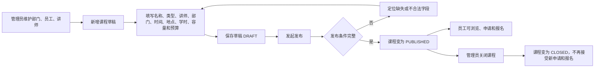

| 节点 | 当前角色 | 入口页面 | 用户动作 | 前置状态 | 成功结果 | 失败/禁止反馈 | 下一步 |
| --- | --- | --- | --- | --- | --- | --- | --- |
| CRS-FLOW-01 | 管理员 | `/system/departments`、`/system/employees`、`/system/trainers` | 维护基础数据 | 已登录且有管理权限 | 课程所需关联数据可用 | 字段错误、重复数据、无权限 | CRS-FLOW-02 |
| CRS-FLOW-02 | 管理员 | `/system/courses/new` | 新增课程 | 讲师和主办部门存在 | 生成 `DRAFT` 课程 | 校验失败时定位字段 | CRS-FLOW-03 |
| CRS-FLOW-03 | 管理员 | `/system/courses` 或课程详情 | 发布课程 | `DRAFT` 且发布字段完整 | 状态变为 `PUBLISHED` | 时间错误、容量不合法、预算为负、关联数据不存在 | EMP-REQ-01 |
| CRS-FLOW-04 | 管理员 | 课程管理 | 关闭课程 | `PUBLISHED` | 状态变为 `CLOSED` | 已关闭、状态冲突、无权限 | 课程生命周期结束 |

发布校验至少包括：课程名称、课程时间、地点、讲师、主办部门、最大人数大于 0、预算金额不为负、开始时间早于结束时间。

## 6. 培训申请、主管审批与 HR 备案流程

### 6.1 申请审批流程图

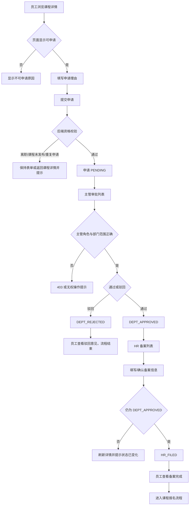

### 6.2 申请状态机

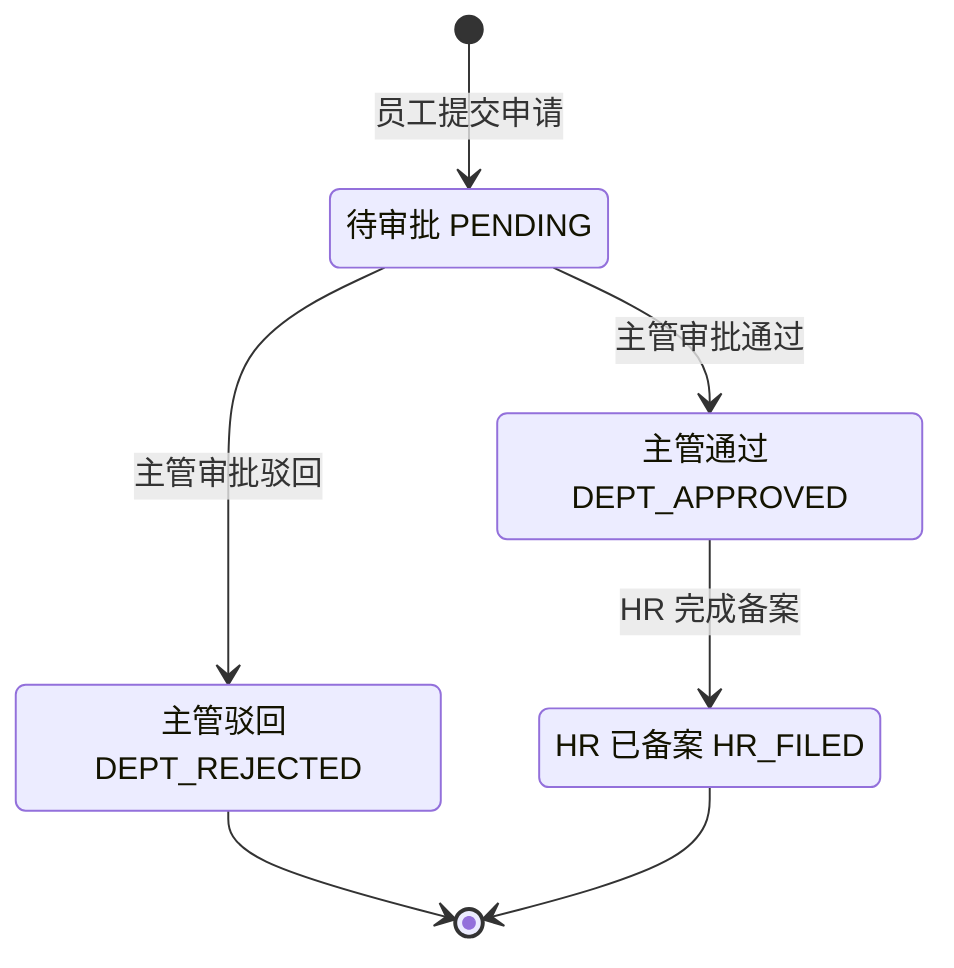

不允许的流转：

- `PENDING` 直接进入 `HR_FILED`。
- `DEPT_REJECTED` 再进入备案。
- 已经审批或备案的申请被重复审批。
- 前端自行修改状态字段代替业务动作。

### 6.3 节点定义

| 节点 | 当前角色 | 入口页面 | 用户动作 | 前置状态 | 成功结果 | 失败/禁止反馈 | 下一步页面/状态 |
| --- | --- | --- | --- | --- | --- | --- | --- |
| EMP-REQ-01 | 员工 | `/courses/:id` | 点击申请 | 员工 `ACTIVE`、课程 `PUBLISHED` | 进入申请表单 | 按钮禁用并说明离职、未发布或已关闭 | `/my/requests/new` |
| EMP-REQ-02 | 员工 | `/my/requests/new` | 填写理由并提交 | 无重复待处理申请 | 创建 `PENDING` 申请 | 字段校验、重复申请、课程状态变化、网络失败 | `/my/requests` 或 `/requests/:id` |
| SUP-REQ-01 | 部门主管 | `/approvals/department` | 查询并打开申请 | 主管有本部门数据权限 | 查看申请详情 | 无权查看进入 403；记录不存在提示 404 | `/requests/:id` |
| SUP-REQ-02 | 部门主管 | 申请详情/审批上下文 | 审批通过 | 申请为 `PENDING` | `DEPT_APPROVED`，记录审批人、时间和意见 | 状态冲突返回 409 并刷新 | 保留列表并刷新/进入下一条 |
| SUP-REQ-03 | 部门主管 | 申请详情/审批上下文 | 审批驳回 | 申请为 `PENDING` | `DEPT_REJECTED`，记录驳回意见 | 驳回意见是否必填待确认；状态冲突刷新 | 保留列表并刷新/进入下一条 |
| HR-REQ-01 | HR | `/filings/hr` | 查询并打开待备案申请 | 申请为 `DEPT_APPROVED` | 查看备案上下文 | 其他状态不可操作 | `/requests/:id` |
| HR-REQ-02 | HR | 申请详情/备案上下文 | 完成备案 | 仍为 `DEPT_APPROVED` | `HR_FILED`，记录 HR 和时间 | 重复备案、状态冲突、无权限 | 返回备案列表并刷新 |
| EMP-REQ-03 | 员工 | `/my/requests` | 查看处理结果 | 本人申请 | 显示状态和意见 | 非本人数据返回 403/404 | 已备案则进入报名流程；驳回则结束 |

## 7. 报名与取消流程

### 7.1 报名资格校验顺序

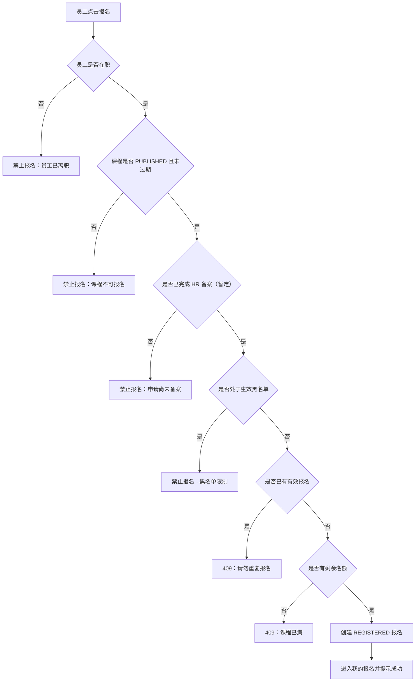

前端可预先显示明显不可报名原因，但点击时必须再次以服务端校验结果为准，避免页面数据过期导致超额或重复报名。

### 7.2 报名状态机

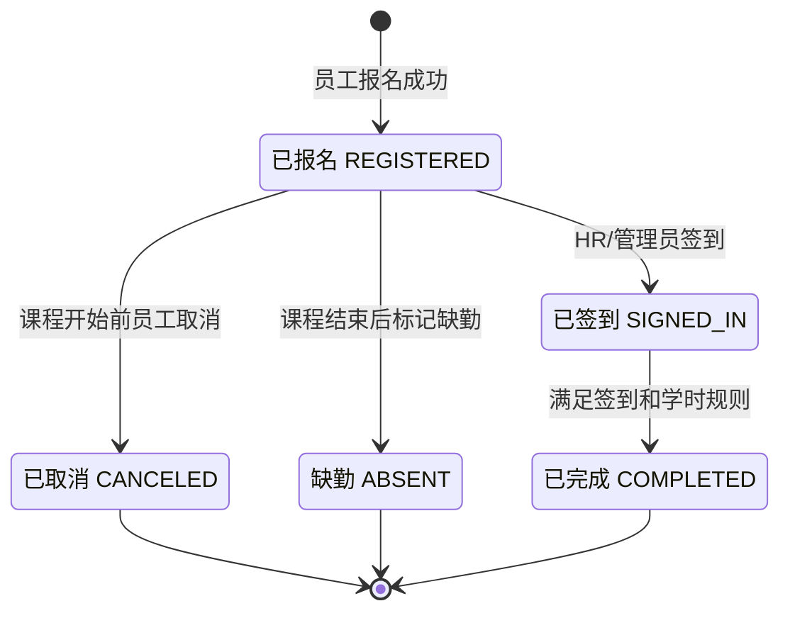

### 7.3 节点定义

| 节点 | 当前角色 | 入口页面 | 用户动作 | 前置状态 | 成功结果 | 失败/禁止反馈 | 下一步页面/状态 |
| --- | --- | --- | --- | --- | --- | --- | --- |
| EMP-REG-01 | 员工 | `/courses/:id` | 点击报名 | 满足报名资格 | 创建 `REGISTERED` | 分别提示备案、黑名单、重复、满员、课程状态等原因 | `/my/registrations` |
| EMP-REG-02 | 员工 | `/my/registrations` 或报名详情 | 取消报名 | `REGISTERED` 且课程未开始 | `CANCELED` | 已签到、已开始、状态冲突时禁止 | 保持当前页并刷新 |
| EMP-REG-03 | 员工 | `/my/registrations` | 查看报名状态 | 本人报名 | 显示报名、签到和实际学时 | 非本人数据不可访问 | 报名详情或课程详情 |

### 7.4 待确认分支

如果评审决定“申请不是报名的强制前置条件”，报名校验将删除 HR 备案判断，但保留员工、课程、容量、黑名单和重复报名校验。

如果评审决定“备案后自动生成报名”，则：

- `HR_FILED` 成功后由后端直接创建报名记录。
- 员工不再点击“报名”，只在“我的报名”查看结果。
- 必须补充容量不足、黑名单或重复报名时，HR 备案事务如何处理的规则。

在上述规则冻结前，本流程继续使用“员工手动报名”。

## 8. 签到、缺勤与完成培训流程

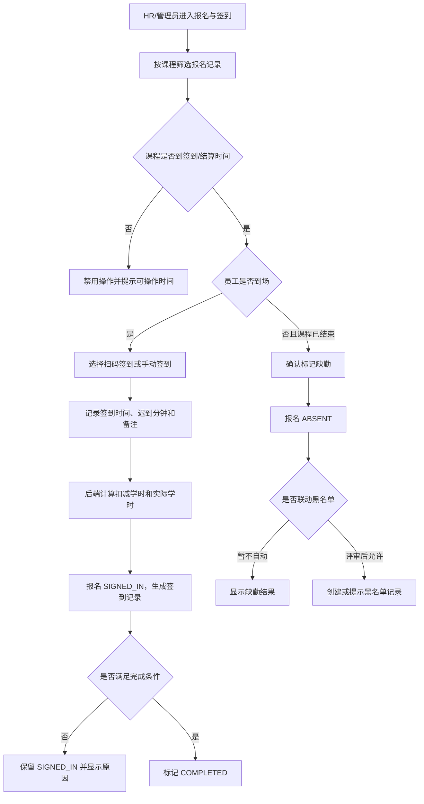

| 节点 | 当前角色 | 入口页面 | 用户动作 | 前置状态 | 成功结果 | 失败/禁止反馈 | 下一步页面/状态 |
| --- | --- | --- | --- | --- | --- | --- | --- |
| OPS-ATT-01 | HR/管理员 | `/operations/attendance` | 选择课程、查询报名 | 有运营权限 | 返回报名记录和状态 | 无权限、课程不存在、加载失败 | 当前页面 |
| OPS-ATT-02 | HR/管理员 | 报名与签到 | 正常/手动签到 | 报名为 `REGISTERED` | 生成签到记录，报名变为 `SIGNED_IN` | 重复签到、非有效报名、时间不允许返回 409/400 | 当前页刷新并显示结果 |
| OPS-ATT-03 | HR/管理员 | 报名与签到 | 录入迟到分钟、签到类型和备注 | 正在签到 | 后端返回扣减学时和实际学时 | 数值不合法、规则计算失败 | 修正后重试 |
| OPS-ATT-04 | HR/管理员 | 报名与签到 | 标记缺勤 | 课程结束且报名仍为 `REGISTERED` | 报名变为 `ABSENT` | 课程未结束、已签到、状态冲突 | 当前页刷新 |
| OPS-ATT-05 | HR/管理员 | 报名与签到 | 标记完成 | 报名为 `SIGNED_IN` 且满足完成条件 | 报名变为 `COMPLETED` | 学时不足、数据未完成、状态冲突 | 保持 `SIGNED_IN` 并显示原因 |

### 8.1 前端反馈要求

- 签到、缺勤和完成均为状态流转操作，必须二次确认并防止重复提交。
- 操作提交中禁用同一行的冲突按钮，不锁死整张表。
- 成功后刷新该报名记录和课程统计，不依赖前端自行加减统计数。
- 迟到扣减和实际学时只展示后端结果，不在前端复制计算公式。
- 缺勤后是否加入黑名单未确认，本版不自动跳转或创建黑名单。

## 9. 评分、测试与证书流程

### 9.1 讲师评分与 HR 复核

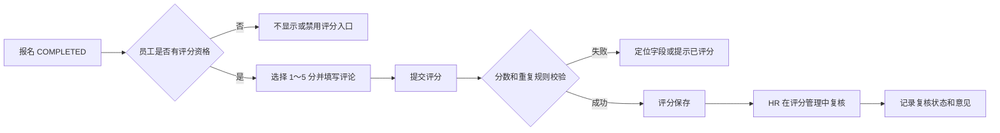

| 节点 | 当前角色 | 入口页面 | 用户动作 | 前置状态 | 成功结果 | 失败/禁止反馈 | 下一步 |
| --- | --- | --- | --- | --- | --- | --- | --- |
| EMP-RAT-01 | 员工 | 我的报名/评分入口 | 提交 1～5 分及评论 | 暂按报名 `COMPLETED` | 生成评分记录 | 分值错误、重复评分、无资格 | 我的报名或评分成功反馈 |
| HR-RAT-01 | HR | `/operations/ratings` | 复核评分并填写意见 | 评分未复核 | 更新复核状态 | 已复核、记录变化、无权限 | 当前列表刷新 |

匿名规则待确认：数据库保存 `EMP_ID`，但是否向讲师、HR 或统计页面隐藏员工身份必须由项目负责人决定。

### 9.2 训前和训后测试

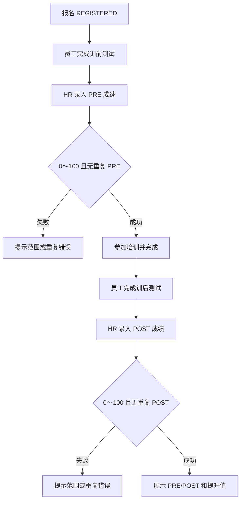

| 节点 | 当前角色 | 入口页面 | 用户动作 | 前置状态 | 成功结果 | 失败/禁止反馈 | 下一步 |
| --- | --- | --- | --- | --- | --- | --- | --- |
| HR-TEST-01 | HR | `/operations/tests/new` | 录入 PRE 成绩 | 有效员工、课程和报名 | 保存唯一 PRE 记录 | 分数超范围、重复 PRE、关联数据不存在 | 测试成绩列表 |
| HR-TEST-02 | HR | `/operations/tests/new` | 录入 POST 成绩 | 员工已参训；精确状态待确认 | 保存唯一 POST 记录 | 分数超范围、重复 POST、状态不允许 | 测试成绩列表 |
| HR-TEST-03 | HR | `/operations/tests` | 查询和对比成绩 | 至少一条测试记录 | 展示 PRE、POST 和提升 | 提升计算口径未冻结时只展示原始成绩 | 当前页面 |
| EMP-TEST-01 | 员工 | `/my/tests` | 查看个人成绩 | 页面权限待确认 | 仅展示本人结果 | 若不纳入范围则不显示菜单 | 我的测试 |

测试通过分数线、测试链接是否在系统内完成、成绩由员工还是 HR 录入均未冻结；本版按“外部测试、HR 录入成绩”设计。

### 9.3 证书生成与查看

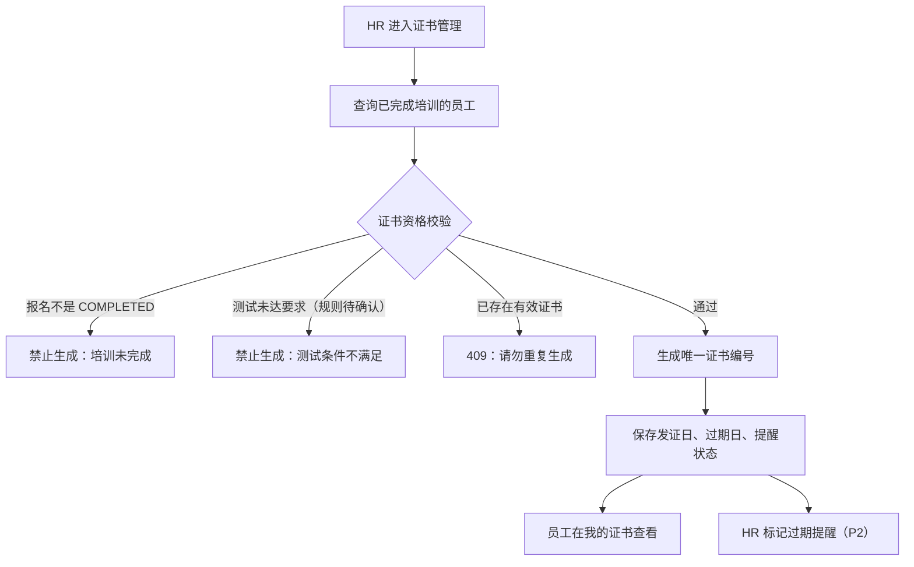

| 节点 | 当前角色 | 入口页面 | 用户动作 | 前置状态 | 成功结果 | 失败/禁止反馈 | 下一步 |
| --- | --- | --- | --- | --- | --- | --- | --- |
| HR-CERT-01 | HR | `/operations/certificates` | 查询候选员工 | 报名 `COMPLETED` | 展示可生成候选项 | 资格不足时显示具体原因 | 当前列表 |
| HR-CERT-02 | HR | 证书管理 | 生成证书 | 完成培训、无重复证书；测试门槛待确认 | 生成唯一证书记录 | 未完成、测试不足、重复证书、状态冲突 | `/certificates/:id` |
| EMP-CERT-01 | 员工 | `/my/certificates` | 查看本人证书 | 已生成证书 | 展示证书编号、课程、发证和过期日期 | 非本人证书不可访问 | `/certificates/:id` |
| HR-CERT-03 | HR | 证书管理 | 标记已发送过期提醒 | 未提醒且满足提醒条件 | `NOTIFIED=Y` | 重复提醒、状态变化 | 当前列表刷新 |

## 10. P0 页面与流程节点对应关系

| P0 页面 | 主要角色 | 承载流程节点 | 成功去向 | 主要异常 |
| --- | --- | --- | --- | --- |
| 登录 | 全部 | AUTH-01～02 | 原目标页或控制台 | 账号错误、认证失败、网络失败 |
| 控制台 | 全部 | 角色化入口 | 各角色待办或列表 | 待办加载失败、无数据 |
| 课程列表 | 全部 | 浏览课程 | 课程详情 | 空数据、搜索无结果、加载失败 |
| 课程详情 | 全部 | EMP-REQ-01、EMP-REG-01 | 申请表单或我的报名 | 未发布、关闭、满员、黑名单 |
| 提交培训申请 | 员工 | EMP-REQ-02 | 我的申请/申请详情 | 校验失败、重复申请、状态冲突 |
| 我的申请 | 员工 | EMP-REQ-03 | 申请详情/课程详情 | 空数据、加载失败 |
| 主管审批 | 部门主管 | SUP-REQ-01～03 | 当前列表/下一条 | 无权限、重复审批、状态变化 |
| HR 备案 | HR | HR-REQ-01～02 | 当前列表/下一条 | 跳过审批、重复备案、状态变化 |
| 我的报名 | 员工 | EMP-REG-01～03 | 报名详情/课程详情 | 重复、取消失败、状态变化 |
| 报名与签到 | HR/管理员 | OPS-ATT-01～05 | 当前列表/报名详情 | 重复签到、时间不允许、学时不足 |
| 我的证书 | 员工 | EMP-CERT-01 | 证书详情 | 空数据、非本人资源 |
| 证书管理 | HR | HR-CERT-01～03 | 证书详情/当前列表 | 资格不足、重复生成、状态冲突 |
| 证书详情 | 员工、HR | EMP-CERT-01、HR-CERT-02 | 返回实际来源页 | 资源不存在、无数据权限 |
| 403 | 已登录用户 | 权限拦截 | 返回首页或有权限页面 | — |
| 404 | 全部 | 路径/资源异常 | 返回首页或来源列表 | — |

## 11. 全局异常与恢复流程

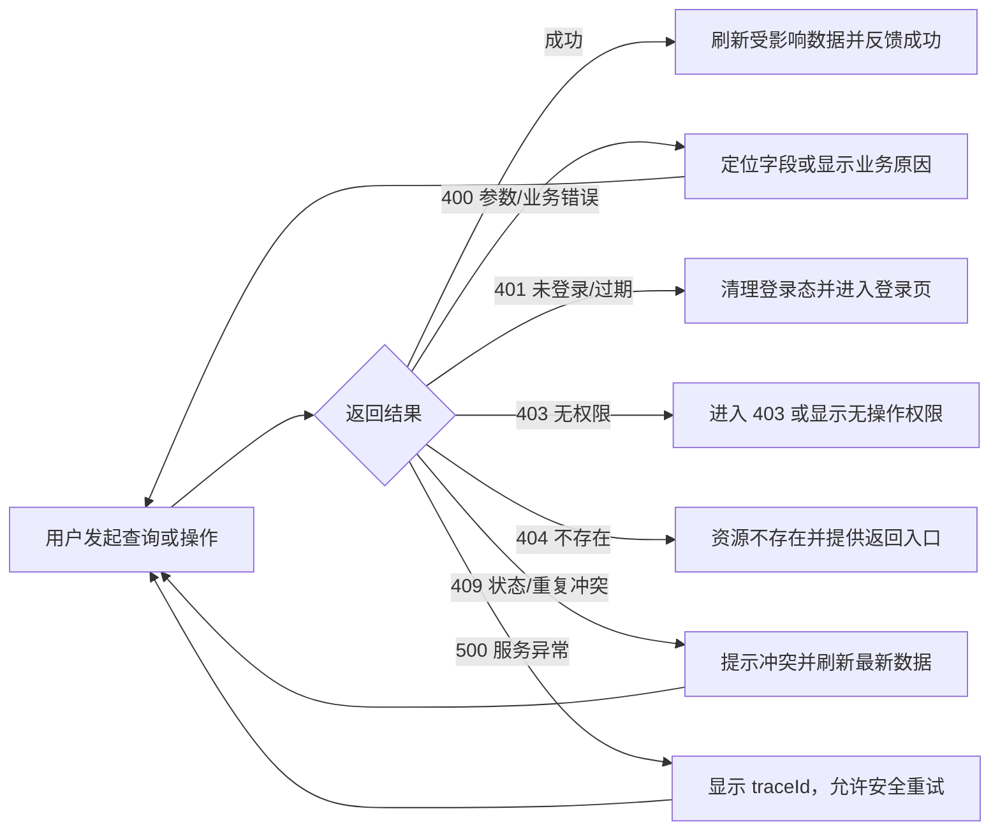

| 场景 | 前端反馈 | 数据处理 | 恢复入口 |
| --- | --- | --- | --- |
| 加载中 | 骨架/加载状态，避免重复请求 | 不修改已有数据 | 等待完成 |
| 空数据 | 说明当前无记录，提供有权限的创建或浏览入口 | 保留筛选条件 | 创建/浏览 |
| 搜索无结果 | 提示调整条件并提供清空筛选 | 不清除用户未确认输入 | 清空筛选 |
| 表单校验失败 | 字段就近提示，第一个错误获得焦点 | 保留已填写内容 | 修正并重试 |
| 重复申请/报名/证书 | 明确指出已有记录，提供查看入口 | 刷新目标对象 | 查看已有记录 |
| 状态已变化 | 告知“记录已由其他人处理” | 重新获取详情和列表 | 按最新状态继续 |
| 课程满员/关闭 | 禁止继续提交并刷新课程状态 | 不做乐观加减 | 返回课程列表 |
| 无权限 | 隐藏无权菜单；直接访问时 403 | 不暴露越权数据 | 控制台 |
| 登录过期 | 提示会话过期并进入登录页 | 清理无效登录态 | 重新登录 |
| 服务失败 | 显示友好文案和 `traceId` | 不清空现有页面数据 | 重试或返回 |

## 12. 主流程演示路径

演示数据应预先准备：一个管理员账号、一个在职员工账号、该员工对应部门主管账号、一个 HR 账号、一个可用部门、一名讲师，以及足够课程容量和预算。

| 序号 | 演示角色 | 页面 | 演示动作 | 预期结果 |
| --- | --- | --- | --- | --- |
| 1 | 管理员 | 课程管理 | 创建课程并发布 | 课程为 `PUBLISHED` |
| 2 | 员工 | 课程中心/详情 | 选择课程并提交申请 | 申请为 `PENDING` |
| 3 | 部门主管 | 主管审批 | 打开该申请并通过 | 申请为 `DEPT_APPROVED` |
| 4 | HR | HR 备案 | 完成备案 | 申请为 `HR_FILED` |
| 5 | 员工 | 课程详情 | 报名该课程 | 报名为 `REGISTERED` |
| 6 | HR | 测试成绩 | 录入 PRE 成绩（若演示 P2） | 生成 PRE 记录 |
| 7 | HR/管理员 | 报名与签到 | 为员工签到 | 报名为 `SIGNED_IN`，生成签到记录 |
| 8 | HR/管理员 | 报名与签到 | 标记完成 | 报名为 `COMPLETED` |
| 9 | 员工 | 讲师评分 | 提交评分（若演示 P2） | 生成评分记录 |
| 10 | HR | 测试成绩 | 录入 POST 成绩（若演示 P2） | 生成 POST 记录 |
| 11 | HR | 证书管理 | 生成证书 | 生成唯一证书编号 |
| 12 | 员工 | 我的证书 | 打开证书详情 | 显示本人证书信息 |

P0 最小演示可暂时跳过第 6、9、10 步，但如果证书最终要求测试通过，则测试步骤必须提升为 P0 并加入证书前置链路。

## 13. 流程评审待确认事项

| 编号 | 待确认问题 | 当前流程基线 | 不同结论造成的影响 | 建议确认人 |
| --- | --- | --- | --- | --- |
| FLOW-Q-001 | HR 备案是否为报名前置 | 是 | 若否，删除报名校验中的备案步骤 | 申请审批、报名模块、项目负责人 |
| FLOW-Q-002 | 备案后是手动报名还是自动生成报名 | 员工手动报名 | 自动生成需要重做备案事务和容量失败流程 | 后端相关模块、项目负责人 |
| FLOW-Q-003 | PRE 测试的执行时间和录入主体 | 报名后、培训前，由 HR 录入 | 会影响页面入口、测试状态和演示顺序 | 成果评估负责人 |
| FLOW-Q-004 | POST 测试是否是完成培训或证书的前置 | 暂不阻塞 `COMPLETED`，证书门槛待确认 | 若强制，P2 测试页面必须提升为 P0 | 成果评估、项目负责人 |
| FLOW-Q-005 | 证书资格是否要求测试及格，及格线是多少 | 至少要求 `COMPLETED` | 影响证书候选列表和失败文案 | 成果评估负责人 |
| FLOW-Q-006 | 员工何时可以评分 | 暂按 `COMPLETED` 后 | 若签到后即可评分，需要调整入口和资格校验 | 成果评估负责人 |
| FLOW-Q-007 | 评分“匿名”的可见范围 | 不预设 | 影响员工提示、HR 列表字段和讲师可见信息 | 项目负责人 |
| FLOW-Q-008 | 迟到扣减和完成培训的学时门槛 | 后端计算，前端只展示 | 影响完成按钮条件和签到详情字段 | 报名签到负责人 |
| FLOW-Q-009 | 缺勤是否自动进入黑名单 | 不自动 | 若自动，需要增加联动成功/失败和事务反馈 | 报名签到、组织模块负责人 |
| FLOW-Q-010 | 驳回意见、手动签到备注是否必填 | 暂定建议必填，不作为已确认规则 | 影响表单校验和审核记录完整性 | 对应后端模块、项目负责人 |
| FLOW-Q-011 | 管理员是否拥有 HR 的备案、测试、评分和证书权限 | 不默认拥有 | 影响角色泳道、菜单和演示账号 | 项目负责人 |
| FLOW-Q-012 | 多角色账号使用权限并集还是切换角色 | 权限并集 | 影响登录后菜单和角色演示方式 | 后端基础、项目负责人 |

## 14. 步骤 5 完成结论

- 已形成管理员、员工、部门主管、HR 和后端规则参与的完整端到端主流程。
- 已覆盖登录、课程发布、申请、审批、备案、报名、取消、签到、缺勤、完成、评分、测试和证书。
- 每个核心节点均给出角色、入口页面、动作、前置状态、成功结果、失败反馈和下一步。
- 已建立申请与报名状态机，并明确禁止状态跳转。
- 已提供 P0 页面映射、全局异常恢复和一条无需手工改库的演示路径。
- 所有未冻结规则均保留为待确认问题，未被当作最终后端约定。
- 本文已通过流程评审，步骤 6：P0 低保真线框设计已经启动。
