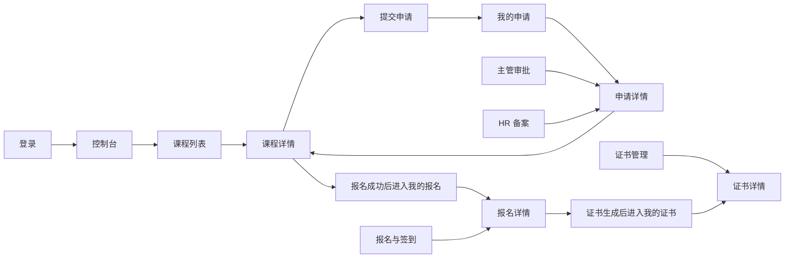

# P0 低保真线框图与交互说明

## 1. 文档信息

| 项目 | 内容 |
| --- | --- |
| 当前阶段 | 第二阶段：流程与线框（步骤 6） |
| 文档版本 | V1.0（P0 线框评审通过） |
| 评审状态 | 已通过；依据 2026-08-03 用户确认进入步骤 7 |
| 设计范围 | 公共框架及 P0 页面，含申请详情、报名详情两个流程辅助页面 |
| 表达方式 | Markdown 字符线框，强调布局、信息层级、字段、操作和跳转，不表达最终颜色与视觉风格 |
| 默认视口 | 桌面后台管理场景，建议设计基准宽度 1440px；响应式规则在后续视觉规范阶段补充 |
| 明确不包含 | HTML 静态原型、Vue 工程、真实接口、最终字段名、精细图标和视觉效果 |

## 2. 线框符号说明

| 符号 | 含义 |
| --- | --- |
| `[主要操作]` | 高优先级按钮，但不代表最终颜色 |
| `[次要操作]` | 普通按钮或文字操作 |
| `[禁用：原因]` | 当前业务状态不允许操作 |
| `[ 输入内容 ]` | 输入框 |
| `[ 请选择 ▼ ]` | 下拉选择 |
| `[ 日期范围 ]` | 日期或日期范围控件 |
| `○` | 单选项 |
| `□` | 复选项 |
| `...` | 暂不展开的重复内容 |
| `（暂定）` | 尚未通过业务或接口评审的内容 |

## 3. P0 页面范围

| 编号 | 页面 | 建议路径 | 角色 | 主要任务 |
| --- | --- | --- | --- | --- |
| WF-P0-01 | 登录 | `/login` | 全部 | 登录系统 |
| WF-P0-02 | 控制台 | `/dashboard` | 全部已登录角色 | 查看角色待办和快捷入口 |
| WF-P0-03 | 课程列表 | `/courses` | 全部已登录角色 | 搜索并浏览课程 |
| WF-P0-04 | 课程详情 | `/courses/:id` | 全部已登录角色 | 查看课程信息并申请或报名 |
| WF-P0-05 | 提交培训申请 | `/my/requests/new` | 员工 | 填写理由并提交申请 |
| WF-P0-06 | 我的申请 | `/my/requests` | 员工 | 查看本人申请和处理结果 |
| WF-P0-07 | 申请详情 | `/requests/:id` | 员工本人、主管、HR | 查看申请及审批记录，承载审批/备案操作 |
| WF-P0-08 | 主管审批 | `/approvals/department` | 部门主管 | 处理本部门待审批申请 |
| WF-P0-09 | HR 备案 | `/filings/hr` | HR | 处理主管通过的申请 |
| WF-P0-10 | 我的报名 | `/my/registrations` | 员工 | 查看、取消报名并进入结果操作 |
| WF-P0-11 | 报名详情 | `/registrations/:id` | 员工本人、HR、管理员 | 查看报名、签到和学时详情 |
| WF-P0-12 | 报名与签到 | `/operations/attendance` | HR、管理员 | 查询报名、签到、缺勤和完成培训 |
| WF-P0-13 | 我的证书 | `/my/certificates` | 员工 | 查询本人证书 |
| WF-P0-14 | 证书管理 | `/operations/certificates` | HR | 查询候选人、生成和管理证书 |
| WF-P0-15 | 证书详情 | `/certificates/:id` | 员工本人、HR | 查看证书完整信息 |
| WF-P0-16 | 403 无权限 | `/403` | 已登录用户 | 说明权限不足并提供返回入口 |
| WF-P0-17 | 404 未找到 | 未匹配路径 | 全部 | 说明页面不存在并提供返回入口 |

## 4. 公共主布局

除登录、403、404 外，P0 业务页统一使用以下主布局。

```text
┌──────────────────────────────────────────────────────────────────────────────────────┐
│ 企业内部培训管理系统                       [消息/待办（暂定）] [姓名·角色 ▼]          │
├──────────────────┬───────────────────────────────────────────────────────────────────┤
│                  │ 面包屑 / 当前页面                                                 │
│  首页            ├───────────────────────────────────────────────────────────────────┤
│  培训中心        │                                                                   │
│  我的培训        │  页面标题                                      [页面级主要操作]  │
│  审批管理        │  页面说明或当前业务状态                                             │
│  培训运营        │                                                                   │
│  系统管理        │  ┌─────────────────────────────────────────────────────────────┐  │
│                  │  │ 页面内容区                                                   │  │
│  （按角色显示）  │  │ 搜索 / 表格 / 表单 / 详情 / 状态反馈                         │  │
│                  │  └─────────────────────────────────────────────────────────────┘  │
│                  │                                                                   │
├──────────────────┴───────────────────────────────────────────────────────────────────┤
│ 系统版本/版权信息（是否展示待确认）                                                   │
└──────────────────────────────────────────────────────────────────────────────────────┘
```

### 4.1 主布局交互规则

- 左侧菜单按当前用户角色权限生成；无权菜单不显示。
- 当前一级分组展开，当前菜单项保持选中。
- 顶部个人菜单至少包含“个人信息”和“退出登录”。
- 面包屑根据实际入口生成；申请详情、证书详情返回实际来源页。
- 列表进入详情后，返回时恢复搜索条件、页码和滚动位置。
- 无权限直接访问业务地址时进入 403，而不是仅隐藏菜单。

## 5. 公共页面线框

### 5.1 WF-P0-01 登录

```text
┌──────────────────────────────────────────────────────────────────────────────────────┐
│                                                                                      │
│             企业内部培训管理                                                         │
│             员工培训申请、审批、报名与成果管理                                       │
│                                                                                      │
│                                      ┌──────────────────────────────────────┐        │
│                                      │ 登录系统                             │        │
│                                      │                                      │        │
│                                      │ 员工账号                             │        │
│                                      │ [ 请输入员工账号                  ]  │        │
│                                      │                                      │        │
│                                      │ 密码                                 │        │
│                                      │ [ 请输入密码                      ]  │        │
│                                      │                                      │        │
│                                      │ [            登录系统            ]  │        │
│                                      │                                      │        │
│                                      │ 登录错误信息区域                     │        │
│                                      └──────────────────────────────────────┘        │
│                                                                                      │
└──────────────────────────────────────────────────────────────────────────────────────┘
```

关键说明：

- 不在当前阶段增加“注册”“找回密码”“第三方登录”等未提出功能。
- 登录提交中禁用按钮并显示处理状态，防止重复提交。
- 登录失败保留账号、清空或保留密码的策略待安全评审。
- 登录成功进入原目标页或控制台；回跳规则暂定。

### 5.2 WF-P0-02 控制台

```text
┌─主布局───────────────────────────────────────────────────────────────────────────────┐
│ 面包屑：首页                                                                         │
│                                                                                      │
│ 你好，[当前用户姓名]                         当前角色：[员工/主管/HR/管理员]          │
│                                                                                      │
│ ┌──────────────────┐ ┌──────────────────┐ ┌──────────────────┐                       │
│ │ 角色待办/概览 1  │ │ 角色待办/概览 2  │ │ 角色待办/概览 3  │                       │
│ │       数量       │ │       数量       │ │       数量       │                       │
│ │ [查看]           │ │ [查看]           │ │ [查看]           │                       │
│ └──────────────────┘ └──────────────────┘ └──────────────────┘                       │
│                                                                                      │
│ ┌─────────────────────────────────────┐ ┌─────────────────────────────────────────┐  │
│ │ 我的待办/最近记录                   │ │ 快捷入口                                │  │
│ │ · 记录标题          状态   时间     │ │ [浏览课程] [我的申请/主管审批]          │  │
│ │ · 记录标题          状态   时间     │ │ [我的报名/报名签到] [证书管理]          │  │
│ │ · ...                              │ │ （仅显示有权限入口）                    │  │
│ │ [查看全部]                          │ │                                         │  │
│ └─────────────────────────────────────┘ └─────────────────────────────────────────┘  │
└──────────────────────────────────────────────────────────────────────────────────────┘
```

角色内容暂定：

| 角色 | 概览/待办建议 | 快捷入口 |
| --- | --- | --- |
| 员工 | 申请状态、待开始课程、即将过期证书 | 浏览课程、我的申请、我的报名、我的证书 |
| 部门主管 | 本部门待审批申请 | 主管审批、课程中心 |
| HR | 待备案、待签到、待生成证书 | HR 备案、报名与签到、证书管理 |
| 管理员 | 员工、讲师、课程及待签到概览 | 员工管理、讲师管理、课程管理、报名与签到 |

统计卡片数量和指标接口尚未确认，后续不得为填充页面虚构统计数据。

### 5.3 WF-P0-16 403 无权限

```text
┌──────────────────────────────────────────────────────────────────────────────────────┐
│                                                                                      │
│                                      403                                             │
│                              你没有访问此页面的权限                                  │
│                                                                                      │
│                       当前账号：[姓名]  当前角色：[角色]                              │
│                   如需访问，请联系管理员或切换有权限账号。                            │
│                                                                                      │
│                         [返回上一页]    [返回首页]                                    │
│                                                                                      │
└──────────────────────────────────────────────────────────────────────────────────────┘
```

### 5.4 WF-P0-17 404 未找到

```text
┌──────────────────────────────────────────────────────────────────────────────────────┐
│                                                                                      │
│                                      404                                             │
│                             页面或资源暂时找不到                                     │
│                                                                                      │
│                   地址可能已失效、记录已删除或链接输入错误。                          │
│                                                                                      │
│                         [返回上一页]    [返回首页]                                    │
│                                                                                      │
└──────────────────────────────────────────────────────────────────────────────────────┘
```

403 与 404 不展示用户无权限看到的资源名称或敏感信息。

## 6. 课程页面线框

### 6.1 WF-P0-03 课程列表

```text
┌─主布局───────────────────────────────────────────────────────────────────────────────┐
│ 培训中心 / 课程中心                                                                  │
│                                                                                      │
│ 课程中心                                                                             │
│ 查找可申请和可报名的培训课程                                                         │
│                                                                                      │
│ ┌─搜索条件────────────────────────────────────────────────────────────────────────┐ │
│ │ 课程名称 [ 输入关键词 ]  课程类型 [ 全部 ▼ ]  状态 [ 已发布 ▼ ]                 │ │
│ │ 开课时间 [ 开始日期  至  结束日期 ]                  [查询] [重置]               │ │
│ └─────────────────────────────────────────────────────────────────────────────────┘ │
│                                                                                      │
│ 共 N 门课程                                                     排序 [开课时间 ▼]    │
│ ┌─────────────────────────────────────────────────────────────────────────────────┐ │
│ │ 课程名称       类型    讲师    开始时间    地点    学时    剩余名额    状态 操作 │ │
│ ├─────────────────────────────────────────────────────────────────────────────────┤ │
│ │ 数据库基础     技能类  王老师  08-20       A101    8       12/30     已发布 [详情]│ │
│ │ 管理能力提升   管理类  李老师  08-25       B202    6       已满      已发布 [详情]│ │
│ │ ...                                                                             │ │
│ └─────────────────────────────────────────────────────────────────────────────────┘ │
│                                           [上一页] 1 2 3 [下一页]  每页 [20 ▼]       │
└──────────────────────────────────────────────────────────────────────────────────────┘
```

关键交互：

- 普通员工默认查看可访问课程，状态筛选是否允许查看已关闭课程待确认。
- 点击课程名称或“详情”进入 `/courses/:id`。
- 搜索、分页和排序均按服务端结果设计，字段以接口冻结版本为准。
- 剩余名额由后端返回，不由前端使用列表数据自行推导。

### 6.2 WF-P0-04 课程详情

```text
┌─主布局───────────────────────────────────────────────────────────────────────────────┐
│ 培训中心 / 课程中心 / 课程详情                                      [返回课程中心]  │
│                                                                                      │
│ 数据库基础训练                                  [已发布]                             │
│ 技能类 · 8 学时 · 08-20 09:00 至 17:00                              [提交申请]      │
│                                                                     [报名课程]      │
│                                                                     或[禁用：原因] │
│ ┌──────────────────────────────────────┬──────────────────────────────────────────┐  │
│ │ 课程信息                             │ 报名信息                                 │  │
│ │ 主办部门：技术部                     │ 最大人数：30                             │  │
│ │ 培训地点：A101                       │ 已报名：18                               │  │
│ │ 课程状态：已发布                     │ 剩余名额：12                             │  │
│ │ 预算金额：（管理员可见，暂定）       │ 我的申请：HR 已备案/未申请               │  │
│ │                                      │ 我的报名：未报名/已报名                   │  │
│ └──────────────────────────────────────┴──────────────────────────────────────────┘  │
│ ┌─────────────────────────────────────────────────────────────────────────────────┐ │
│ │ 讲师信息                                                                        │ │
│ │ 姓名：王老师    职称：高级讲师    公司：同济培训中心    星级：4/5               │ │
│ └─────────────────────────────────────────────────────────────────────────────────┘ │
│ ┌─────────────────────────────────────────────────────────────────────────────────┐ │
│ │ 课程资料与测试                                                                  │ │
│ │ [课件资料] [训前测试（暂定）] [训后测试（暂定）]                                │ │
│ └─────────────────────────────────────────────────────────────────────────────────┘ │
└──────────────────────────────────────────────────────────────────────────────────────┘
```

按钮条件：

| 操作 | 显示角色 | 可操作条件 | 不可操作反馈 |
| --- | --- | --- | --- |
| 提交申请 | 员工 | 在职、课程 `PUBLISHED`、无重复待处理申请 | 已离职、未发布/已关闭、已有待处理申请 |
| 报名课程 | 员工 | 暂按申请 `HR_FILED`，且在职、不在黑名单、未重复、未满员 | 明确显示备案、黑名单、重复、满员或状态原因 |
| 编辑课程 | 管理员 | 有管理权限；具体从课程管理入口展示 | 发布后字段限制待确认 |
| 关闭课程 | 管理员 | 课程 `PUBLISHED` | 已关闭或状态冲突 |

“申请”和“报名”同时出现时容易产生歧义。当前暂定：申请未备案时突出“提交/查看申请”，备案完成后突出“报名课程”。

## 7. 申请、审批与备案页面线框

### 7.1 WF-P0-05 提交培训申请

```text
┌─主布局───────────────────────────────────────────────────────────────────────────────┐
│ 我的培训 / 我的申请 / 提交申请                                      [返回]          │
│                                                                                      │
│ 提交培训申请                                                                       │
│                                                                                      │
│ ┌─所选课程（只读）────────────────────────────────────────────────────────────────┐ │
│ │ 课程：数据库基础训练          类型：技能类          学时：8                     │ │
│ │ 时间：08-20 09:00—17:00      讲师：王老师          地点：A101                  │ │
│ └─────────────────────────────────────────────────────────────────────────────────┘ │
│                                                                                      │
│ 申请人（只读）  [ 当前员工姓名 ]                                                     │
│ 所属部门（只读）[ 技术部 ]                                                           │
│                                                                                      │
│ 申请理由 *                                                                          │
│ ┌─────────────────────────────────────────────────────────────────────────────────┐ │
│ │ 请输入参加该培训的原因、目标或工作需要                                           │ │
│ │                                                                                 │ │
│ └─────────────────────────────────────────────────────────────────────────────────┘ │
│ 0 / 500                                                                              │
│                                                                                      │
│                                   [取消]  [提交申请]                                 │
└──────────────────────────────────────────────────────────────────────────────────────┘
```

交互说明：

- 课程、申请人和部门来自上下文，只读展示，不允许用户修改关联 ID。
- 申请理由是否必填根据业务说明暂按必填设计，提交前需要评审确认。
- 提交中禁用按钮；成功后进入申请详情或我的申请列表。
- 离开未保存表单时二次确认。

### 7.2 WF-P0-06 我的申请

```text
┌─主布局───────────────────────────────────────────────────────────────────────────────┐
│ 我的培训 / 我的申请                                                                  │
│                                                                                      │
│ 我的申请                                                        [浏览课程并申请]     │
│                                                                                      │
│ ┌─搜索条件────────────────────────────────────────────────────────────────────────┐ │
│ │ 课程名称 [ 输入关键词 ]  申请状态 [ 全部 ▼ ]  申请日期 [ 日期范围 ] [查询][重置]│ │
│ └─────────────────────────────────────────────────────────────────────────────────┘ │
│                                                                                      │
│ ┌─────────────────────────────────────────────────────────────────────────────────┐ │
│ │ 申请编号  课程名称      申请日期    状态        当前处理人/阶段          操作    │ │
│ ├─────────────────────────────────────────────────────────────────────────────────┤ │
│ │ R001      数据库基础    08-01       待审批      部门主管                 [详情]  │ │
│ │ R002      安全培训      07-20       主管驳回    已结束                   [详情]  │ │
│ │ R003      管理能力      07-10       HR已备案    可进入报名               [详情]  │ │
│ │ ...                                                                             │ │
│ └─────────────────────────────────────────────────────────────────────────────────┘ │
│                                           [上一页] 1 2 3 [下一页]                    │
└──────────────────────────────────────────────────────────────────────────────────────┘
```

### 7.3 WF-P0-07 申请详情（流程辅助页）

```text
┌─主布局───────────────────────────────────────────────────────────────────────────────┐
│ [来源菜单] / 申请详情                                            [返回来源列表]      │
│                                                                                      │
│ 申请 R001：数据库基础训练                                      [待审批]              │
│                                                                                      │
│ ┌─流程进度────────────────────────────────────────────────────────────────────────┐ │
│ │ ● 员工提交  ─────  ○ 主管审批  ─────  ○ HR备案                                 │ │
│ │ 08-01 10:20         待处理                 未开始                               │ │
│ └─────────────────────────────────────────────────────────────────────────────────┘ │
│ ┌──────────────────────────────────────┬──────────────────────────────────────────┐  │
│ │ 申请信息                             │ 课程摘要                                 │  │
│ │ 申请人：张三                         │ 课程：数据库基础训练                     │  │
│ │ 部门：技术部                         │ 时间：08-20 09:00—17:00                  │  │
│ │ 申请日期：08-01 10:20                │ 讲师：王老师                             │  │
│ │ 申请理由：……                         │ 地点：A101                               │  │
│ └──────────────────────────────────────┴──────────────────────────────────────────┘  │
│ ┌─审批与备案记录──────────────────────────────────────────────────────────────────┐ │
│ │ 主管：[待处理/姓名·时间·意见]                                                    │ │
│ │ HR：  [未开始/姓名·时间]                                                         │ │
│ └─────────────────────────────────────────────────────────────────────────────────┘ │
│                                                                                      │
│ 角色操作区：                                                                         │
│ 主管且状态=PENDING： [驳回] [审批通过]                                               │
│ HR且状态=DEPT_APPROVED： [完成备案]                                                  │
│ 员工且状态=HR_FILED： [查看课程] [去报名]                                            │
└──────────────────────────────────────────────────────────────────────────────────────┘
```

操作弹窗草案：

```text
┌─审批确认────────────────────────────────────────────┐
│ 当前操作：审批通过 / 驳回                           │
│ 审批意见 *（是否必填待确认）                        │
│ [                                                ] │
│ [                                                ] │
│                         [取消] [确认操作]            │
└─────────────────────────────────────────────────────┘
```

### 7.4 WF-P0-08 主管审批

```text
┌─主布局───────────────────────────────────────────────────────────────────────────────┐
│ 审批管理 / 主管审批                                                                  │
│                                                                                      │
│ 主管审批                                                                             │
│ 仅展示当前主管有权处理的部门申请                                                     │
│                                                                                      │
│ ┌─搜索条件────────────────────────────────────────────────────────────────────────┐ │
│ │ 员工 [ 姓名/工号 ]  课程 [ 课程名称 ]  状态 [ 待审批 ▼ ]  日期 [范围] [查询][重置]│ │
│ └─────────────────────────────────────────────────────────────────────────────────┘ │
│                                                                                      │
│ 待审批 N 条                                                                          │
│ ┌─────────────────────────────────────────────────────────────────────────────────┐ │
│ │ 申请编号 员工  部门    课程名称      申请日期      申请理由摘要      状态  操作  │ │
│ ├─────────────────────────────────────────────────────────────────────────────────┤ │
│ │ R001     张三  技术部  数据库基础    08-01 10:20  工作需要……       待审批       │ │
│ │                                                         [详情] [驳回] [通过]    │ │
│ │ ...                                                                             │ │
│ └─────────────────────────────────────────────────────────────────────────────────┘ │
│                                           [上一页] 1 2 3 [下一页]                    │
└──────────────────────────────────────────────────────────────────────────────────────┘
```

关键规则：

- 不提供批量通过，避免审批意见和状态并发处理不清。
- 点击通过或驳回使用确认弹窗；操作成功刷新当前行和待审批数量。
- 记录已被其他人处理时提示状态冲突并刷新，不覆盖最新结果。

### 7.5 WF-P0-09 HR 备案

```text
┌─主布局───────────────────────────────────────────────────────────────────────────────┐
│ 审批管理 / HR 备案                                                                   │
│                                                                                      │
│ HR 备案                                                                              │
│ 仅“主管通过”的申请可以执行备案                                                       │
│                                                                                      │
│ ┌─搜索条件────────────────────────────────────────────────────────────────────────┐ │
│ │ 员工 [ 姓名/工号 ]  部门 [ 全部 ▼ ]  课程 [ 课程名称 ]  日期 [范围] [查询][重置]│ │
│ └─────────────────────────────────────────────────────────────────────────────────┘ │
│                                                                                      │
│ 待备案 N 条                                                                          │
│ ┌─────────────────────────────────────────────────────────────────────────────────┐ │
│ │ 申请编号 员工  部门    课程名称    主管/时间       主管意见摘要       状态  操作 │ │
│ ├─────────────────────────────────────────────────────────────────────────────────┤ │
│ │ R003     李四  市场部  管理能力    王主管 08-02   同意参加……        主管通过     │ │
│ │                                                              [详情] [完成备案] │ │
│ │ ...                                                                             │ │
│ └─────────────────────────────────────────────────────────────────────────────────┘ │
│                                           [上一页] 1 2 3 [下一页]                    │
└──────────────────────────────────────────────────────────────────────────────────────┘
```

备案确认弹窗至少展示员工、课程、主管审批结论和当前状态，防止 HR 处理错记录。是否需要填写备案备注待确认。

## 8. 报名与签到页面线框

### 8.1 WF-P0-10 我的报名

```text
┌─主布局───────────────────────────────────────────────────────────────────────────────┐
│ 我的培训 / 我的报名                                                                  │
│                                                                                      │
│ 我的报名                                                        [浏览课程]           │
│                                                                                      │
│ ┌─搜索条件────────────────────────────────────────────────────────────────────────┐ │
│ │ 课程名称 [ 输入关键词 ]  报名状态 [ 全部 ▼ ]  开课时间 [ 日期范围 ] [查询][重置]│ │
│ └─────────────────────────────────────────────────────────────────────────────────┘ │
│                                                                                      │
│ ┌─────────────────────────────────────────────────────────────────────────────────┐ │
│ │ 课程名称    开课时间      地点   报名日期   报名状态  实际学时       操作        │ │
│ ├─────────────────────────────────────────────────────────────────────────────────┤ │
│ │ 数据库基础  08-20 09:00   A101   08-05      已报名    —       [详情] [取消报名]  │ │
│ │ 安全培训    07-15 09:00   B202   07-01      已完成    6       [详情] [讲师评分]  │ │
│ │ 管理能力    06-10 09:00   C303   05-20      缺勤      0       [详情]             │ │
│ │ ...                                                                             │ │
│ └─────────────────────────────────────────────────────────────────────────────────┘ │
│                                           [上一页] 1 2 3 [下一页]                    │
└──────────────────────────────────────────────────────────────────────────────────────┘
```

操作条件：

- `REGISTERED` 且课程未开始：显示“取消报名”。
- `SIGNED_IN`：只显示详情和实际学时，等待完成处理。
- `COMPLETED`：显示“讲师评分”（评分资格细则待确认）和证书状态。
- `ABSENT`、`CANCELED`：只读展示结果。

### 8.2 WF-P0-11 报名详情（流程辅助页）

```text
┌─主布局───────────────────────────────────────────────────────────────────────────────┐
│ 我的培训 / 我的报名 / 报名详情                                      [返回]          │
│                                                                                      │
│ 数据库基础训练                                                  [已签到]             │
│                                                                                      │
│ ┌─状态进度────────────────────────────────────────────────────────────────────────┐ │
│ │ ● 报名成功  ─────  ● 已签到  ─────  ○ 培训完成                                 │ │
│ │ 08-05 12:00         08-20 09:06         待处理                                 │ │
│ └─────────────────────────────────────────────────────────────────────────────────┘ │
│ ┌──────────────────────────────────────┬──────────────────────────────────────────┐  │
│ │ 课程信息                             │ 报名信息                                 │  │
│ │ 时间：08-20 09:00—17:00             │ 报名编号：REG001                         │  │
│ │ 地点：A101                           │ 报名日期：08-05 12:00                    │  │
│ │ 讲师：王老师                         │ 状态：已签到                             │  │
│ │ 课程学时：8                          │ 实际学时：7.5                            │  │
│ └──────────────────────────────────────┴──────────────────────────────────────────┘  │
│ ┌─签到记录────────────────────────────────────────────────────────────────────────┐ │
│ │ 签到类型：手动签到        签到时间：08-20 09:06                                 │ │
│ │ 迟到分钟：6               扣减学时：0.5          备注：……                       │ │
│ └─────────────────────────────────────────────────────────────────────────────────┘ │
│ [取消报名/禁用原因] [进入讲师评分（符合条件时）] [查看证书（已生成时）]             │
└──────────────────────────────────────────────────────────────────────────────────────┘
```

### 8.3 WF-P0-12 报名与签到

```text
┌─主布局───────────────────────────────────────────────────────────────────────────────┐
│ 培训运营 / 报名与签到                                                                │
│                                                                                      │
│ 报名与签到                                                                           │
│ [报名记录] [签到处理]（是否使用页签待评审）                                           │
│                                                                                      │
│ ┌─课程与查询条件──────────────────────────────────────────────────────────────────┐ │
│ │ 课程 [ 课程名称/编号 ▼ ]  员工 [ 姓名/工号 ]  状态 [ 全部 ▼ ]  [查询] [重置]   │ │
│ └─────────────────────────────────────────────────────────────────────────────────┘ │
│                                                                                      │
│ 当前课程：数据库基础训练   时间：08-20 09:00—17:00   地点：A101                     │
│ 已报名 N   已签到 N   缺勤 N   已完成 N（统计均由后端返回）                          │
│                                                                                      │
│ ┌─────────────────────────────────────────────────────────────────────────────────┐ │
│ │ 员工  部门   报名状态  签到时间  迟到  实际学时  操作                           │ │
│ ├─────────────────────────────────────────────────────────────────────────────────┤ │
│ │ 张三  技术部 已报名    —         —     —         [签到] [标记缺勤] [详情]       │ │
│ │ 李四  市场部 已签到    09:06     6分   7.5       [标记完成] [详情]              │ │
│ │ 王五  财务部 已完成    08:58     0分   8         [详情]                          │ │
│ │ ...                                                                             │ │
│ └─────────────────────────────────────────────────────────────────────────────────┘ │
│                                           [上一页] 1 2 3 [下一页]                    │
└──────────────────────────────────────────────────────────────────────────────────────┘
```

签到操作弹窗：

```text
┌─签到确认────────────────────────────────────────────┐
│ 员工：张三        课程：数据库基础训练              │
│ 签到类型 *  ○ 扫码签到  ○ 手动签到                 │
│ 签到时间 *  [ YYYY-MM-DD HH:mm ]                    │
│ 迟到分钟    [ 后端计算或只读结果，待接口确认 ]      │
│ 备注        [                                   ]   │
│                                                   │
│ 实际学时由后端计算，提交后显示结果。                │
│                              [取消] [确认签到]      │
└─────────────────────────────────────────────────────┘
```

缺勤/完成操作：

- 标记缺勤必须二次确认，说明可能影响报名状态和黑名单；自动入黑名单尚未确认。
- 标记完成前展示签到和实际学时，后端不通过时显示具体原因。
- 同一行提交中仅禁用该行冲突操作，防止重复签到或重复完成。

## 9. 证书页面线框

### 9.1 WF-P0-13 我的证书

```text
┌─主布局───────────────────────────────────────────────────────────────────────────────┐
│ 我的培训 / 我的证书                                                                  │
│                                                                                      │
│ 我的证书                                                                             │
│                                                                                      │
│ ┌─搜索条件────────────────────────────────────────────────────────────────────────┐ │
│ │ 课程名称 [ 输入关键词 ]  发证日期 [ 日期范围 ]  状态 [ 全部 ▼（暂定）] [查询][重置]│ │
│ └─────────────────────────────────────────────────────────────────────────────────┘ │
│                                                                                      │
│ ┌─────────────────────────────────────────────────────────────────────────────────┐ │
│ │ 证书编号              课程名称      发证日期    过期日期    状态        操作     │ │
│ ├─────────────────────────────────────────────────────────────────────────────────┤ │
│ │ CERT-20260820-01-01   数据库基础    08-20       2028-08-20  有效        [详情]   │ │
│ │ CERT-20250701-02-01   安全培训      2025-07-01  2026-07-01  已过期      [详情]   │ │
│ │ ...                                                                             │ │
│ └─────────────────────────────────────────────────────────────────────────────────┘ │
│                                           [上一页] 1 2 3 [下一页]                    │
└──────────────────────────────────────────────────────────────────────────────────────┘
```

证书“有效/即将过期/已过期”是否由接口直接返回或根据日期展示计算，等待接口确认；前端不修改证书业务状态。

### 9.2 WF-P0-14 证书管理

```text
┌─主布局───────────────────────────────────────────────────────────────────────────────┐
│ 培训运营 / 证书管理                                                                  │
│                                                                                      │
│ 证书管理                                                                             │
│ [待生成候选] [已生成证书]（是否使用页签待评审）                                       │
│                                                                                      │
│ ┌─搜索条件────────────────────────────────────────────────────────────────────────┐ │
│ │ 员工 [ 姓名/工号 ]  部门 [ 全部 ▼ ]  课程 [ 名称 ]  发证状态 [全部▼] [查询][重置]│ │
│ └─────────────────────────────────────────────────────────────────────────────────┘ │
│                                                                                      │
│ ┌─────────────────────────────────────────────────────────────────────────────────┐ │
│ │ 员工 部门   课程名称    报名状态  测试结果（待确认）  证书状态      操作          │ │
│ ├─────────────────────────────────────────────────────────────────────────────────┤ │
│ │ 张三 技术部 数据库基础  已完成    PRE 80 / POST 90    未生成        [生成证书]    │ │
│ │ 李四 市场部 管理能力    已签到    —                   不满足条件    [查看原因]    │ │
│ │ 王五 财务部 安全培训    已完成    —                   已生成        [详情][提醒]  │ │
│ │ ...                                                                             │ │
│ └─────────────────────────────────────────────────────────────────────────────────┘ │
│                                           [上一页] 1 2 3 [下一页]                    │
└──────────────────────────────────────────────────────────────────────────────────────┘
```

生成证书确认：

```text
┌─生成证书────────────────────────────────────────────┐
│ 员工：张三        课程：数据库基础训练              │
│ 报名状态：已完成  实际学时：8                       │
│ 测试结果：PRE 80 / POST 90（是否作为条件待确认）    │
│                                                   │
│ 发证日期 *  [ YYYY-MM-DD ]                         │
│ 过期日期    [ YYYY-MM-DD ]                         │
│                                                   │
│ 证书编号由系统生成，重复证书将被拦截。              │
│                              [取消] [确认生成]      │
└─────────────────────────────────────────────────────┘
```

### 9.3 WF-P0-15 证书详情

```text
┌─主布局───────────────────────────────────────────────────────────────────────────────┐
│ [我的证书/证书管理] / 证书详情                                    [返回来源列表]    │
│                                                                                      │
│ ┌─────────────────────────────────────────────────────────────────────────────────┐ │
│ │                              培训证书                                            │ │
│ │                                                                                 │ │
│ │                    兹证明 [员工姓名]                                             │ │
│ │             已完成《数据库基础训练》课程                                         │ │
│ │                                                                                 │ │
│ │ 证书编号：CERT-20260820-01-01       培训学时：8                                  │ │
│ │ 发证日期：2026-08-20                过期日期：2028-08-20                         │ │
│ │                                                                                 │ │
│ │                         企业内部培训管理系统                                     │ │
│ └─────────────────────────────────────────────────────────────────────────────────┘ │
│                                                                                      │
│ HR 视角附加信息：员工编号、部门、报名编号、提醒状态             [标记已提醒（P2）] │
│ 员工视角：只展示本人证书，不展示运营字段                                             │
└──────────────────────────────────────────────────────────────────────────────────────┘
```

当前只设计证书信息展示，不增加下载 PDF、打印、分享或二维码功能；如需这些能力应单独确认。

## 10. 页面字段与操作汇总

| 页面 | 核心展示/输入字段 | 主要操作 | 成功反馈 | 主要冲突反馈 |
| --- | --- | --- | --- | --- |
| 登录 | 员工账号、密码 | 登录 | 进入目标页 | 账号错误、账号无效、服务失败 |
| 控制台 | 当前用户、角色、待办摘要 | 进入快捷页面 | 打开目标页 | 卡片加载失败 |
| 课程列表 | 名称、类型、状态、时间、讲师、地点、余量 | 查询、重置、查看详情 | 展示结果 | 无结果、加载失败 |
| 课程详情 | 课程、讲师、时间、地点、学时、容量、资料 | 申请、报名 | 进入表单/生成报名 | 未发布、满员、黑名单、重复 |
| 提交申请 | 课程摘要、申请人、部门、申请理由 | 提交、取消 | 申请 `PENDING` | 重复申请、课程变化、字段错误 |
| 我的申请 | 编号、课程、日期、状态、处理阶段 | 查询、查看详情 | 展示结果 | 加载失败 |
| 申请详情 | 申请、课程、流程进度、审批记录 | 通过、驳回、备案、去报名 | 状态流转成功 | 403、409、重复处理 |
| 主管审批 | 员工、部门、课程、日期、理由、状态 | 通过、驳回、详情 | 刷新当前行 | 越权、状态变化 |
| HR 备案 | 员工、部门、课程、主管意见、状态 | 备案、详情 | 状态 `HR_FILED` | 非主管通过、重复备案 |
| 我的报名 | 课程、时间、状态、学时 | 取消、详情、评分 | 状态刷新 | 已开始、已签到、状态变化 |
| 报名详情 | 课程、报名、签到、迟到、学时 | 取消、评分、查看证书 | 进入对应页面 | 状态不允许 |
| 报名与签到 | 课程、员工、报名状态、签到、学时 | 签到、缺勤、完成 | 当前行及统计刷新 | 重复签到、时间不允许、学时不足 |
| 我的证书 | 编号、课程、发证日、过期日 | 查询、详情 | 展示本人证书 | 无数据、资源不存在 |
| 证书管理 | 员工、课程、完成状态、测试、证书状态 | 生成、详情、提醒 | 生成证书 | 资格不足、重复证书 |
| 证书详情 | 编号、员工、课程、发证日、过期日 | 返回、提醒（HR） | 状态刷新 | 非本人、记录不存在 |

## 11. 关键弹窗与反馈位置

| 场景 | 建议载体 | 说明 |
| --- | --- | --- |
| 主管通过/驳回 | 确认弹窗 | 显示申请摘要并填写意见 |
| HR 备案 | 确认弹窗 | 显示员工、课程和主管结论 |
| 取消报名 | 确认弹窗 | 显示课程和不可撤销后果 |
| 签到 | 表单弹窗 | 填写签到类型、时间、备注，学时由后端返回 |
| 标记缺勤 | 危险操作确认弹窗 | 提示可能产生黑名单影响，但不擅自执行联动 |
| 标记完成 | 确认弹窗 | 展示签到和实际学时 |
| 生成证书 | 表单确认弹窗 | 展示资格信息并填写发证/过期日期 |
| 表单字段错误 | 字段下方 | 保留已填内容并聚焦第一个错误 |
| 状态冲突 | 页面消息 + 当前行刷新 | 明确记录已变化，不覆盖后端最新状态 |
| 无权限 | 403 或操作提示 | 页面级进入 403，按钮级说明无权操作 |
| 登录过期 | 全局提示后回登录页 | 是否保留未提交表单待后续确认 |

## 12. 页面跳转关系



## 13. 低保真阶段暂定事项

| 编号 | 暂定事项 | 当前线框处理 | 评审影响 |
| --- | --- | --- | --- |
| WF-Q-001 | 控制台统计指标未冻结 | 使用角色待办占位，不写死指标 | 确认后调整卡片和列表 |
| WF-Q-002 | HR 备案是否为报名前置 | 备案完成后显示报名入口 | 若非前置，课程详情操作逻辑变化 |
| WF-Q-003 | 报名是否自动生成 | 暂按员工手动报名 | 自动生成后删除报名按钮和流程 |
| WF-Q-004 | 申请、报名详情使用独立页还是抽屉 | 暂按独立页表达完整信息 | 评审后可改为抽屉，不影响信息结构 |
| WF-Q-005 | 报名管理与签到是否分开 | 暂用同页页签 | 影响菜单和页面数量 |
| WF-Q-006 | 驳回意见、签到备注是否必填 | 在线框中标注待确认 | 影响表单星号和校验 |
| WF-Q-007 | 评分是否匿名及何时可评分 | 仅保留完成后入口 | 影响报名详情字段和入口文案 |
| WF-Q-008 | 测试是否为证书前置 | 证书管理展示测试结果占位 | 若强制，测试页需提升为 P0 |
| WF-Q-009 | 证书有效状态计算方式 | 展示状态但不规定计算位置 | 等接口冻结后映射 |
| WF-Q-010 | 管理员是否拥有全部 HR 操作 | 仅明确管理员参与签到 | 影响菜单和业务按钮 |
| WF-Q-011 | 首页消息/待办入口是否存在 | 标记暂定 | 可删除，不影响主流程 |
| WF-Q-012 | 是否支持扫码签到 | 保留签到类型，但当前不设计扫码界面 | 若需扫码页，应新增设备/移动端流程 |

## 14. P0 线框评审清单

### 14.1 页面完整性

- [ ] 17 个 P0 及流程辅助页面均有明确入口和返回关系。
- [ ] 登录、主布局、403、404 的公共结构可以复用。
- [ ] 员工、主管、HR、管理员均能从菜单找到职责内页面。
- [ ] 申请、报名和证书详情的角色差异已经确认。

### 14.2 业务连续性

- [ ] 管理员发布课程后，员工可以浏览并提交申请。
- [ ] 申请可以连续完成主管通过和 HR 备案。
- [ ] 备案完成后的报名方式已经确认。
- [ ] 报名可以连续进入签到、完成和证书生成。
- [ ] 演示流程不要求手工修改数据库。

### 14.3 字段与操作

- [ ] 每个列表的搜索条件、主要列和行操作满足业务需要。
- [ ] 每个表单区分只读字段、必填字段和待确认字段。
- [ ] 每个关键按钮都有角色条件和业务状态条件。
- [ ] 审批、备案、签到、缺勤、完成和证书操作均有确认反馈。

### 14.4 下一阶段门禁

- [ ] P0 页面结构完成前端内部评审。
- [ ] 业务模块负责人确认主流程和关键字段。
- [ ] 项目负责人确认页面优先级与演示路径。
- [ ] 所有未确认事项保留“暂定/待确认”标记。

## 15. 步骤 6 完成标准

- 公共页面及全部 P0 页面均形成低保真线框。
- 页面能够表达布局、信息层级、搜索条件、表格字段、表单字段、操作和跳转。
- 关键按钮已说明显示条件、可操作条件和失败反馈。
- 线框与权限矩阵、信息架构、路由规划和核心流程保持一致。
- 当前成果只用于评审，不作为正式前端实现或最终接口定义。
- 本文已通过评审，步骤 7：视觉与组件规范设计已经启动。
