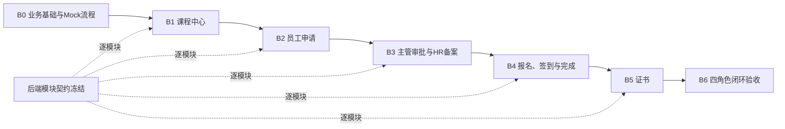

# P0业务页面实施计划

## 1. 文档信息

| 项目 | 内容 |
| --- | --- |
| 项目名称 | 企业内部培训管理系统 |
| 负责岗位 | 前端业务页面负责人 |
| 对应任务 | `FE-BIZ-06`～`FE-BIZ-09`、`FE-BIZ-11`；课程中心列表属于P0浏览入口，不包含P1课程管理 |
| 文档版本 | V1.0（B0～B5 Mock验收通过） |
| 编制日期 | 2026-08-23 |
| 工程路径 | `src/frontend/training-management-web/` |
| 当前状态 | B0～B5已完成Mock验收；公共页4页+P0业务页13页全部实现；进入B6闭环验收收口，不进入P1 |
| 开发策略 | 设计稿冻结、Mock优先、领域服务隔离、按模块验收、接口冻结后逐模块联调 |

## 2. 目标与范围

### 2.1 实施目标

在M0～M6公共基础能力之上，实现课程、培训申请、主管审批、HR备案、报名签到和证书共13个P0业务内容页，并形成可复位、可跨角色演示的完整Mock业务闭环。

本计划完成后，应满足以下结果：

1. 13个业务路由全部从`BusinessPlaceholderView.vue`切换为真实页面组件。
2. 员工、部门主管、HR和管理员可按权限完成P0主流程。
3. 正常、空数据、无搜索结果、加载、失败、无权限、资源不存在、并发冲突和结果未知均有明确页面反馈。
4. 页面只依赖领域服务接口，不直接引用Mock数据、HTTP DTO、后端Base URL或认证账号。
5. Mock模式可独立验收；后端契约冻结后可替换为HTTP适配器，而不重写页面。

### 2.2 数量口径

| 分类 | 页面 | 数量 | 当前状态 |
| --- | --- | ---: | --- |
| 已完成公共页 | 登录、控制台、403、404 | 4 | M3～M6已实现并验收 |
| 本计划业务页 | HF-P0-03～HF-P0-15 | 13 | 13/13已实现并替换占位路由 |
| P0合计 | HF-P0-01～HF-P0-17 | 17 | 设计17/17完成；代码17/17完成 |

“17个P0设计稿已完成”不等于“17个P0业务页面代码已完成”。本计划只实施剩余13页，不重复开发已交付的4个公共页。

### 2.3 不在本计划范围

- P1/P2的员工、部门、讲师、后台课程、黑名单、评分、测试、统计和角色权限页面。
- 真实认证、服务端权限实现、数据库、部署、CORS和生产监控。
- 证书PDF、打印、二维码、下载、到期提醒等未纳入P0设计的能力。
- 未经设计评审的页面扩展或对冻结Figma稿的大规模改版。
- 用前端提交的员工ID、部门ID代替后端登录上下文进行数据范围控制。

## 3. 权威实施依据

实施发生冲突时，按“已评审设计文档与Figma → M6公共契约 → 待确认接口建议”的顺序处理；接口建议不得覆盖已冻结的页面行为。

| 依据 | 用途 |
| --- | --- |
| `document/frontend-design/02-角色权限矩阵.md` | 页面、按钮和数据范围权限 |
| `document/frontend-design/04-页面与路由规划.md` | 路由、名称、角色和返回关系 |
| `document/frontend-design/05-核心业务流程.md` | 主流程、分支、状态流转和异常恢复 |
| `document/frontend-design/06-视觉与组件规范.md` | 视觉令牌、组件形态、响应式和文案 |
| `document/frontend-design/07-页面状态规范.md` | 页面状态、错误、冲突和可访问性 |
| `document/frontend-design/08-Mock数据字典.md` | 固定数据、场景、冲突码和流程快照 |
| `document/frontend-design/09-P0高保真与交互原型.md` | 13页Figma实现基线 |
| `document/frontend-design/10-接口需求与待确认事项.md` | 页面接口、字段、分页和契约阻塞项 |
| `document/frontend-design/11-前端设计评审记录.md` | 设计放行结论和残余风险 |
| `document/frontend-development/03-M6公共基础能力验收与交接.md` | 已交付的路由、组件、服务、Mock/HTTP和质量门禁 |

## 4. 当前工程基线

### 4.1 已具备能力

- Vue 3、TypeScript、Vite、Pinia、Vue Router和Element Plus工程可运行。
- 主布局、认证布局、公共布局、角色菜单、路由守卫、403和404已完成。
- `PageHeader`、`QueryPanel`、`DataTable`、`StatusTag`、`PageState`、确认对话框和反馈组件已具备。
- 统一服务错误、Mock/HTTP适配、超时、取消、重复提交和结果未知处理已有基础实现。
- `CourseService`已有列表示例，可在不破坏页面边界的前提下扩展详情和操作资格。
- `pnpm check`、Playwright、Mock构建、联调构建和非Mock产物扫描已纳入工程。

### 4.2 当前缺口

- 13个P0业务路由均已切换为真实页面组件；占位组件不再由业务路由使用。
- 主管审批、HR备案、报名签到、证书领域页面和写操作已实现并通过Mock验收。
- 共享Mock仓储、8个流程快照、跨角色状态流转和显式复位测试已建立。
- 领域服务测试、业务流转测试、页面专项E2E和全量Chromium E2E已建立。
- 后端接口仍是设计需求初稿，不能据此宣称真实联调完成。

## 5. 实施顺序与依赖



后续模块可在前一模块通过Mock验收后启动。某一后端模块契约冻结后即可单独接入HTTP适配器，不必等待全部后端API完成。

| 阶段 | 页面数 | 目标 | 前置条件 | 退出条件 | 状态 |
| --- | ---: | --- | --- | --- | --- |
| B0 | 0 | 建立4个业务领域的类型、服务、Mock仓储、场景复位和测试骨架 | M6已交付 | 服务边界与快照流转测试通过 | 已完成 |
| B1 | 2 | 课程列表、课程详情和员工操作资格 | B0 | 全角色可浏览；员工申请/报名入口按资格正确显示 | 已完成 |
| B2 | 3 | 发起申请、我的申请、申请详情 | B1 | 员工可提交并追踪申请，异常状态完整 | 已完成 |
| B3 | 2 | 主管审批、HR备案 | B2 | 申请可从待审批流转至已备案，角色和部门范围正确 | 已完成 |
| B4 | 3 | 我的报名、报名详情、报名与签到 | B3 | 已备案申请可报名、签到、缺勤或完成 | 已完成 |
| B5 | 3 | 我的证书、证书管理、证书详情 | B4 | 完成培训后可生成并查看证书 | 已完成 |
| B6 | 0 | 完整回归、设计核对、文档和截图 | B1～B5 | 13页DoD全部通过，主流程可重复演示 | 已完成 |

## 6. 13个页面实施矩阵

| ID | 页面与路由 | Figma节点 | 允许角色 | 所属阶段 | 关键能力 | 主要验收状态 |
| --- | --- | --- | --- | --- | --- | --- |
| HF-P0-03 | 课程中心 `/courses` | `268:13` | 全角色 | B1 | 搜索、筛选、分页、详情跳转 | 正常、业务空、无结果、失败、刷新恢复 |
| HF-P0-04 | 课程详情 `/courses/:id` | `275:107` | 全角色 | B1 | 详情、讲师、场次、名额、申请/报名资格 | 加载、正常、不可操作原因、404、403、冲突 |
| HF-P0-05 | 发起培训申请 `/my/requests/new` | `286:408` | 员工 | B2 | 课程摘要、申请原因、提交防重 | 校验、提交中、字段错误、重复申请、结果未知 |
| HF-P0-06 | 我的申请 `/my/requests` | `292:3` | 员工 | B2 | 本人申请查询、状态筛选、详情跳转 | 多状态、空、无结果、失败、返回恢复 |
| HF-P0-07 | 申请详情 `/requests/:id` | `303:3` | 员工/主管/HR | B2 | 申请与审批时间线、角色化信息 | 四种主状态、403、404、状态刷新 |
| HF-P0-08 | 主管审批 `/approvals/department` | `308:3` | 主管 | B3 | 本部门待办、通过、驳回、意见 | 空/无结果、校验、确认、并发冲突、越权 |
| HF-P0-09 | HR备案 `/filings/hr` | `312:3` | HR | B3 | 已通过申请查询、备案确认 | 空/无结果、加载、成功、重复备案、状态冲突 |
| HF-P0-10 | 我的报名 `/my/registrations` | `317:439` | 员工 | B4 | 本人报名查询、取消、详情 | 五种状态、取消确认、课程已开始、结果未知 |
| HF-P0-11 | 报名详情 `/registrations/:id` | `327:102` | 员工/HR/管理员 | B4 | 课程、员工、签到、学时、操作资格 | 无签到、非本人、404、状态变化、取消冲突 |
| HF-P0-12 | 报名与签到 `/operations/attendance` | `332:432` | HR/管理员 | B4 | 课程筛选、签到、缺勤、完成培训 | 未选课程、空/无结果、重复签到、学时不足、冲突 |
| HF-P0-13 | 我的证书 `/my/certificates` | `341:3` | 员工 | B5 | 本人证书搜索、状态展示、详情 | 正常、空、无结果、失败、过期状态刷新 |
| HF-P0-14 | 证书管理 `/operations/certificates` | `357:3` | HR | B5 | 候选与已发证查询、生成证书 | 无候选、资格不足、生成中、重复证书、结果未知 |
| HF-P0-15 | 证书详情 `/certificates/:id` | 员工`361:3`；HR`361:18` | 员工/HR | B5 | 员工视角、HR视角、证书信息 | 正常、403、404、未知枚举安全兜底 |

实际路由角色码以当前工程`EMPLOYEE`、`MANAGER`、`HR`、`ADMIN`为准；后端若使用`DEPT_MANAGER`，由认证/DTO适配层映射，不在页面内分支处理。

## 7. 分阶段实施清单

### 7.1 B0：业务基础与Mock流程

- [x] 建立`course`、`training-request`、`registration`、`certificate`四个领域目录和导出入口。
- [x] 定义页面模型、查询条件、分页结果、操作命令、资格结果和稳定业务错误码。
- [x] 建立领域服务接口，并分别提供Mock实现和HTTP实现入口；未冻结HTTP调用以明确TODO标记。
- [x] 将DTO到领域模型的转换放在适配层；页面不得判断HTTP状态码或后端原始字段名。
- [x] 建立共享Mock仓储，覆盖`FLOW-SNAPSHOT-01`～`FLOW-SNAPSHOT-08`和冲突场景。
- [x] 提供测试专用的快照装载、复位和版本升级机制；每个自动化用例独立复位。
- [x] Mock业务状态跨页面、跨账号切换保持一致，认证退出不得误删业务快照。
- [x] 写操作实现提交中禁用、防重复、409刷新和“结果未知后查询最终状态”。
- [x] 为未知枚举、未知错误码和缺失可选字段提供安全兜底。
- [x] 完成服务契约、状态转换和Mock/HTTP选择逻辑测试。

建议目录，不要求页面照搬后端表结构：

```text
src/
  domains/
    course/
    training-request/
    registration/
    certificate/
  services/
    course/
    training-request/
    registration/
    certificate/
  mocks/
    fixtures/
    repositories/
    scenarios/
  views/
    courses/
    requests/
    approvals/
    registrations/
    certificates/
```

### 7.2 B1：课程中心

- [x] 实现课程列表的关键词、类型、状态、日期范围、分页、重置和URL查询同步。
- [x] 返回详情时恢复筛选、页码和滚动位置，并刷新可能变化的名额和操作资格。
- [x] 实现课程详情、讲师/场次/名额展示及申请、报名入口。
- [x] 非员工只浏览课程；员工按钮状态由`ActionEligibility`决定并展示原因。
- [x] 报名成功后更新课程余量和本人报名；冲突后刷新详情，不伪造成功。
- [x] 完成Figma节点HF-P0-03、HF-P0-04的1024px与1440px核对。

### 7.3 B2：员工培训申请

- [x] 发起申请页从`courseId`重新获取课程摘要，不依赖上一页传递完整对象。
- [x] 申请原因有标签、长度和必填校验；字段错误定位到首个错误控件。
- [x] 防止重复待处理申请、课程状态变化和离职员工继续提交。
- [x] 我的申请支持状态、课程、日期筛选、分页和详情跳转。
- [x] 申请详情展示`PENDING`、`DEPT_APPROVED`、`DEPT_REJECTED`、`HR_FILED`时间线。
- [x] 同一详情路由按角色呈现允许的信息，不在页面绕过数据范围校验。

### 7.4 B3：主管审批与HR备案

- [x] 主管只看到本部门`PENDING`申请；前端请求不提交可信`deptId`扩大范围。
- [x] 通过与驳回均使用确认层；驳回意见按设计校验并保留失败前输入。
- [x] HR只处理`DEPT_APPROVED`申请，完成备案后同步详情与待办数量。
- [x] 对“已被他人处理、状态不允许、重复备案、越权部门”显示不同反馈。
- [x] 409后关闭或更新失效操作，刷新目标行并保留列表查询位置。
- [x] Mock演示支持员工提交→主管通过/驳回→HR备案的跨账号流转。

### 7.5 B4：报名、签到与完成培训

- [x] 我的报名覆盖`REGISTERED`、`SIGNED_IN`、`COMPLETED`、`ABSENT`、`CANCELED`。
- [x] 员工取消报名时校验课程未开始且尚未签到；冲突后刷新资格和目标行。
- [x] 报名详情按员工本人、HR和管理员数据视角呈现，并显示签到及实际学时。
- [x] 报名与签到页支持课程/员工/部门/状态筛选和分页，不允许无课程时误操作。
- [x] 实现签到、补签、缺勤和完成培训确认；按钮由服务返回的资格和原因控制。
- [x] 重复签到、无有效报名、时间不允许、学时不足和并发处理有独立反馈。
- [x] 完成培训后使记录进入证书候选，但不由页面直接构造证书资格结论。

### 7.6 B5：证书

- [x] 我的证书只展示当前员工范围，支持编号、课程、展示状态和日期查询。
- [x] 证书管理区分候选记录和已发证记录，资格原因由服务返回。
- [x] 生成证书采用`registrationId`和幂等/重复提交保护；未知结果后先查询。
- [x] 员工证书详情与HR证书详情使用同一路由、不同数据范围和信息层级。
- [x] 有效、临期、过期和未知状态均有文字与图形/标签语义，不只依赖颜色。
- [x] P0不展示尚未实现的PDF、打印、二维码、下载或到期提醒入口。

### 7.7 B6：闭环验收与交付

- [x] 13个路由均不再引用`BusinessPlaceholderView.vue`。
- [x] 从固定快照复位后可重复演示完整主流程和关键异常分支。
- [x] 以员工、主管、HR、管理员四类账号逐一核对菜单、路由、按钮和数据范围。
- [x] 逐页核对Figma结构、间距、信息层级、交互、文案和响应式行为。
- [x] 完成类型、Lint、格式、单测、组件测试、Mock构建、联调构建和E2E。
- [x] 非Mock生产产物不得包含Mock账号、密码、固定业务数据和场景控制代码。
- [x] 更新实施进度、验收记录、接口问题清单和演示截图索引。

## 8. 领域服务与接口边界

| 领域服务 | 页面所需能力 | 设计期接口建议 | 联调门禁 |
| --- | --- | --- | --- |
| `CourseService` | 查询列表、详情和操作资格 | `GET /api/courses`、`GET /api/courses/{id}`、资格接口 | 资格合并方式、字段和错误码冻结 |
| `TrainingRequestService` | 新建、本人列表、详情、待办、主管处理、HR备案 | `/api/training-requests`及动作子路径 | 状态流转、数据范围、并发版本和动作路径冻结 |
| `RegistrationService` | 创建报名、本人/管理列表、详情、取消、签到、缺勤、完成 | `/api/registrations`、`/api/attendance/manual` | 报名字段、补签边界、时间规则、学时和资格字段冻结 |
| `CertificateService` | 本人/管理列表、候选、生成、详情 | `/api/certificates`及`/candidates` | 候选来源、唯一性、有效期和权限冻结 |

页面只能调用领域服务。HTTP适配器负责响应解包、DTO映射、枚举兼容和统一错误转换；Mock适配器遵守同一接口与同一错误语义。

列表统一遵循当前暂定口径：页码从1开始，默认每页20条，可选10/20/50；筛选变化回到第1页；服务端分页；空字符串不作为有效过滤条件。最终参数名以冻结OpenAPI为准。

## 9. Mock流程与数据策略

### 9.1 双模式

- 固定场景模式：直接装载页面正常、空、无结果、失败、403、404、409和未知结果场景，用于组件与视觉验收。
- 可变流程模式：从固定快照开始，按真实操作更新共享仓储，用于跨角色闭环演示。

### 9.2 主流程快照

| 快照 | 业务状态 | 下一步动作 |
| --- | --- | --- |
| FLOW-SNAPSHOT-01 | 尚无申请 | 员工发起申请 |
| FLOW-SNAPSHOT-02 | `PENDING` | 主管审批 |
| FLOW-SNAPSHOT-03 | `DEPT_APPROVED` | HR备案 |
| FLOW-SNAPSHOT-04 | `HR_FILED` | 员工报名 |
| FLOW-SNAPSHOT-05 | `REGISTERED` | HR/管理员签到 |
| FLOW-SNAPSHOT-06 | `SIGNED_IN`且已有考勤 | 完成培训 |
| FLOW-SNAPSHOT-07 | `COMPLETED`且无证书 | HR生成证书 |
| FLOW-SNAPSHOT-08 | 已生成证书 | 员工/HR查看详情 |

固定关联ID沿用设计字典，如申请`5001`、报名`6001`、考勤`7001`、证书`10001`。测试不得依赖上一用例残留数据；每个用例开始前显式装载目标快照。

## 10. 页面通用实现要求

### 10.1 状态与反馈

- 列表页必须区分首次加载、正常、业务空、筛选无结果、局部刷新和失败。
- 详情页必须区分加载、正常、资源不存在、无权访问、状态变化和请求失败。
- 写操作必须区分校验失败、业务冲突、权限失败、服务失败和结果未知。
- 操作成功后刷新受影响的列表、详情、资格、名额或待办计数，不能只弹成功提示。
- 未知状态或未知枚举使用安全文案并保留原始可诊断信息，不静默映射成正常状态。

### 10.2 路由与列表恢复

- 可分享的筛选、页码和排序进入URL query；临时弹窗和敏感内容不进入URL。
- 列表进入详情再返回时恢复查询、页码和滚动位置。
- 直接刷新详情必须可凭路由参数重新获取数据。
- 路由参数缺失或非法时显示可恢复的页面内错误，不触发无意义请求。

### 10.3 权限与安全

- 菜单、路由和按钮三层权限保持一致，但前端权限仅用于体验，不替代服务端校验。
- 员工本人、主管本部门和HR授权范围由服务端登录上下文决定。
- 403与资源404语义按最终后端契约统一，页面不得通过探测暴露资源存在性。
- 错误提示不展示SQL、堆栈、Token、内部地址或其他员工的敏感信息。

### 10.4 可访问性与响应式

- 表单控件有可关联标签；必填和错误不只用颜色表达。
- 确认对话框打开后聚焦首个合理控件，关闭后返回触发按钮。
- 校验失败聚焦首个错误字段；异步反馈对辅助技术可感知。
- 1024px下关键筛选、主操作和恢复入口不可被裁切；窄视口按设计折行或横向滚动。

## 11. 测试与质量门禁

### 11.1 每阶段最低测试

| 层级 | 覆盖内容 |
| --- | --- |
| 单元测试 | DTO映射、资格、状态映射、查询规范化、错误转换、快照流转 |
| 组件测试 | 加载/空/失败/冲突、表单校验、按钮禁用、确认和焦点恢复 |
| 路由测试 | 四角色访问、直接刷新、403、404、返回状态恢复 |
| E2E | 每个模块一条成功主路径、一条关键冲突、一条权限或资源异常 |
| 视觉核对 | 1024px和1440px关键页面截图与Figma逐项对照 |
| 构建边界 | Mock构建和联调构建均通过；非Mock产物扫描无Mock敏感值 |

阶段提交前至少执行：

```powershell
corepack pnpm check
corepack pnpm build:integration
corepack pnpm exec playwright test --project=chromium
```

若全局`pnpm`可用，可省略`corepack`。不得通过忽略控制台错误、跳过失败测试或放宽断言完成验收。

### 11.2 页面完成定义（DoD）

每个页面只有同时满足以下条件才可标记完成：

- Figma主要结构、信息层级、文案和交互一致。
- 页面矩阵中的正常、空、失败、权限、404、冲突等适用状态均实现。
- 权限、数据范围、路由恢复和写操作防重符合规范。
- 页面只依赖领域服务，不直接依赖Mock和HTTP细节。
- 单元/组件/E2E测试达到该页风险所需覆盖，相关质量命令通过。
- 无阻塞级控制台错误、未处理Promise、明显可访问性问题或1024px关键裁切。
- 对应计划项、验收结论和残余后端阻塞已更新。

## 12. 后端并行与联调边界

### 12.1 Mock开发可直接推进

已完成的17页设计、角色矩阵、状态规范、Mock字典和服务隔离足以支持B0～B6的Mock实现，不需要等待后端全部API完成。

### 12.2 真实联调必须等待的门禁

- 认证方式、角色码、多角色、权限码和会话失效行为冻结。
- 统一响应、分页、时间、金额、空值、错误码和`traceId`冻结。
- 各领域的路径、字段、枚举、数据范围和状态流转冻结。
- 写操作幂等、并发冲突、结果未知查询策略和403/404策略冻结。
- OpenAPI或等价契约可追踪，并与真实环境至少完成一次契约验证。

`document/frontend-design/12-问题与修改清单.md`中的DR/API待确认项只有在后端给出证据后才能关闭。Mock通过只能证明前端交互完整，不能替代真实接口验收。

### 12.3 模块级联调顺序

1. 课程查询与操作资格。
2. 培训申请、主管审批和HR备案。
3. 报名、取消、签到、缺勤和完成培训。
4. 证书候选、生成与查询。
5. 四角色端到端真实环境回归。

模块联调发现契约差异时优先修改HTTP适配器；只有业务语义或已评审设计发生变化时，才修改领域接口和页面。

## 13. 交付物

- 13个P0业务页面及其页面级组件。
- 4个领域的类型、服务接口、Mock适配器和HTTP适配器。
- 可复位Mock仓储、8个流程快照及页面/冲突场景。
- 单元测试、组件测试、路由测试和Playwright端到端用例。
- 关键页面1024px/1440px验收截图。
- 更新后的实施进度、验收记录、接口问题清单和必要的开发说明。

## 14. 进度与验收记录

| 阶段 | 状态 | 开始日期 | 完成日期 | 验收人/方式 | 备注 |
| --- | --- | --- | --- | --- | --- |
| B0 业务基础与Mock流程 | 已完成 | 2026-08-22 | 2026-08-22 | 自动化+代码审查 | Mock验收通过；8个流程快照、领域服务、DTO映射和错误/状态流转测试通过 |
| B1 课程中心 | 已完成 | 2026-08-22 | 2026-08-22 | 自动化+页面验收 | Mock验收通过；课程列表/详情、四角色、异常路径、5项课程Chromium用例及16项全量回归通过，1024/1440截图通过 |
| B2 员工申请 | 已完成 | 2026-08-23 | 2026-08-23 | 自动化+页面验收 | Mock验收通过；申请领域、三页、四状态、权限/异常路径、4项申请Chromium用例及20项全量回归通过，1024/1440截图通过 |
| B3 主管审批与HR备案 | 已完成 | 2026-08-23 | 2026-08-23 | 自动化+页面验收 | Mock验收通过；主管/HR跨账号状态流转、空/无结果/冲突路径通过 |
| B4 报名、签到与完成 | 已完成 | 2026-08-23 | 2026-08-23 | 自动化+页面验收 | Mock验收通过；报名详情、签到/缺席/完成、冲突和结果未知通过 |
| B5 证书 | 已完成 | 2026-08-23 | 2026-08-23 | 自动化+页面验收 | Mock验收通过；候选生成、已生成证书、详情和越权路径通过 |
| B6 P0闭环验收 | 已完成 | 2026-08-23 | 2026-08-23 | 自动化+页面验收 | 13/13业务页、23项Chromium E2E、构建和路由扫描通过 |

状态只允许使用“未开始、进行中、待验收、已完成、阻塞”。未执行自动化和页面验收不得标记“已完成”；真实API未接入时必须明确写“Mock验收通过”，不得写成“联调通过”。

## 15. 启动动作

本批次B0～B5及B6闭环验收已完成并通过Mock验收；当前P0业务范围全部完成，本次交付在此停止，不进入B7或扩展P1后台课程管理。

## 16. B0/B1验收结果与残余风险

### 16.1 自动化与构建结果

- `corepack pnpm check`：通过；类型检查、ESLint、格式检查、65项单元/组件测试和Mock构建全部通过。
- `corepack pnpm build:integration`：通过；联调产物使用HTTP适配器，未启用Mock数据。
- `corepack pnpm exec playwright test --project=chromium`：通过23/23；包含课程、申请、审批/备案、报名/签到/完成、证书生成/详情、四角色和异常路径。
- 页面专项Chromium E2E：B3～B5通过3/3；关键页面已按1024px/1440px核对，主要结构、信息层级、操作可见性和无裁切通过。

### 16.2 路由交付边界

13个业务路由均已替换`BusinessPlaceholderView.vue`并使用独立页面组件：课程列表、课程详情、发起申请、我的申请、申请详情、主管审批、HR备案、我的报名、报名详情、报名与签到、我的证书、证书管理、证书详情。路由条件映射扫描通过，未知保护路由回退到404，不再回退到业务占位页。

### 16.3 B2页面验收与实现边界

- 发起申请页从`courseId`重新获取课程；员工和部门上下文为只读；理由必填且最多500字，校验失败保留输入并聚焦控件。
- 我的申请支持课程关键词、状态、日期范围、页码和页大小URL同步；筛选无结果、业务空和服务失败分别呈现；详情返回沿用列表上下文。
- 申请详情覆盖`PENDING`、`DEPT_APPROVED`、`DEPT_REJECTED`、`HR_FILED`时间线，直接刷新按申请ID重新获取，并由服务控制员工本人、主管本部门和HR范围。
- 创建申请使用提交中禁用和单飞控制；重复申请、课程状态变化、409和结果未知均不伪造成功；结果未知先查询最终状态。
- 关键截图：`test-results/request-create-1024.png`、`test-results/request-detail-1440.png`，已核对主要结构、信息层级、可读性和无裁切；课程详情摘要在1440px下使用单列描述避免窄栏日期竖排。

### 16.4 后端契约与残余风险

- 真实API契约仍未冻结；课程详情资格字段、报名关联字段、幂等/并发版本、稳定错误码和统一响应结构继续由HTTP适配层TODO隔离，当前只能写“Mock验收通过”，不能写“真实联调通过”。
- Mock共享仓储已支持跨页面、跨账号和显式快照复位；员工本人、主管本部门和HR数据范围仍必须由后端登录上下文最终保证。
- B1报名成功、409和结果未知，B2申请创建/重复申请/权限边界，B3审批备案，B4签到/缺席/完成，B5证书生成和结果未知均已覆盖；未扩展P1页面。
